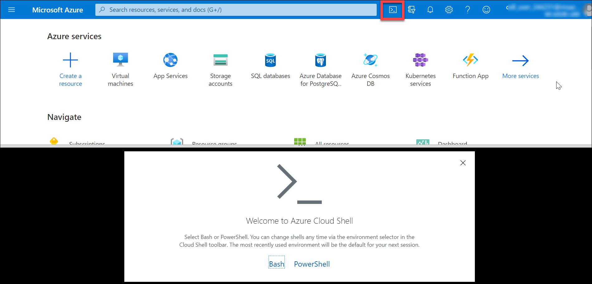
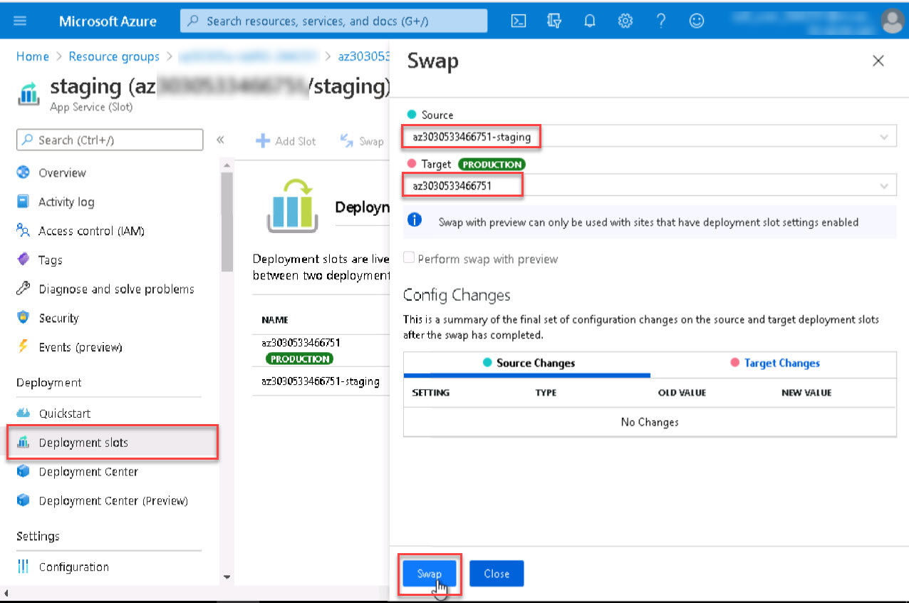

# Lab: Implementing an Azure App Service Web App with a Staging Slot
# Student lab manual

## Lab scenario

Adatum Corporation has a number of web apps that are updated on relatively frequent basis. While Adatum has not yet fully embraced DevOps principles, it relies on Git as its version control and is exploring the options to streamline the app updates. As Adatum is transitioning some of its workloads to Azure, the Adatum Enterprise Architecture team decided to evaluate the use of Azure App Service and its deployment slots to accomplish this objective. 

Deployment slots are live apps with their own host names. App content and configurations elements can be swapped between two deployment slots, including the production slot. Deploying apps to a non-production slot has the following benefits:

- It is possible to validate app changes in a staging deployment slot before swapping it with the production slot.

- Deploying an app to a slot first and swapping it into production makes sure that all instances of the slot are warmed up before being swapped into production. This eliminates downtime when during app deployment. The traffic redirection is seamless, and no requests are dropped because of swap operations. This workflow can be automated by configuring auto swap when pre-swap validation is not needed.

- After a swap, the slot with previously staged app has the previous production app. If the changes swapped into the production slot need to be reversed, this simply involves another swap immediately to return to the last known good state.

Deployment slots facilitate two common deployment patterns: blue/green and A/B testing. Blue-green deployment involves deploying an update into a production environment that is separate from the live application. After the deployment is validated, traffic routing is switched to the updated version. A/B testing involves gradually routing some of the traffic to a staging site in order to test a new version of an app.

The Adatum Architecture team wants to use Azure App Service web apps with deployment slots in order to test these two deployment patterns:

-  Blue/Green deployments 

-  A/B testing 


## Objectives
  
After completing this lab, you will be able to:

-  Implement Blue/Green deployment pattern by using deployment slots of Azure App Service web apps

-  Perform A/B testing by using deployment slots of Azure App Service web apps


## Lab Environment
  
Estimated Time: 60 minutes


## Lab Files

None

## Instructions

### Exercise 1: Implement an Azure App Service web app

1. Deploy an Azure App Service web app

1. Create an App Service web app deployment slot

#### Task 1: Deploy an Azure App Service web app

1. From your lab computer, start a web browser, navigate to the [Azure portal](https://portal.azure.com), and sign in by providing credentials of a user account with the Owner role in the subscription you will be using in this lab.

1. In the Azure portal, open **Cloud Shell** pane by selecting on the toolbar icon directly to the right of the search textbox.

   
    
1. If prompted to select either **Bash** or **PowerShell**, select **Bash**. 
  
     >**Note**: 
    
     i. If this is the first time you are starting **Cloud Shell** and you are presented with the **You have no storage mounted** message, select the subscription you are using in this lab and **click on Show advanced settings**.
    
       
    
     ii. Select existing Resource Group as **az3035a-labRG-Deployment-id** and enter unique names for **storage account name** and **File Share** and select **Create storage**. 

       

1. From the Cloud Shell pane, run the following to create a new directory named **az30305a1** and set it as your current directory:

   ```sh
   mkdir az30305a1
   cd ~/az30305a1/
   ```

1. From the Cloud Shell pane, run the following to clone a sample app repository to the **az30305a1** directory:

   ```sh
   REPO=https://github.com/Azure-Samples/html-docs-hello-world.git
   git clone $REPO
   cd html-docs-hello-world
   ```

1. From the Cloud Shell pane, run the following to configure a deployment user:

   ```sh
   USERNAME=az30305user$RANDOM
   PASSWORD=az30305pass$RANDOM
   az webapp deployment user set --user-name $USERNAME --password $PASSWORD 
   echo $USERNAME
   echo $PASSWORD
   ```
1. Verify that the deployment user was created successfully. If you receive an error message indicating a conflict, repeat the previous step.

    >**Note**: Make sure to record the value of the username and the corresponding password.

1. From the Cloud Shell pane, run the following to create variables storing the values of location and resource group which will be used to host the App Service web app (replace the `<location>` placeholder with the name of the Azure region that is available in your subscription and which is closest to the location of your lab computer):

   ```sh
   LOCATION='<location>'
   RGNAME='az30305a-labRG-Deployment-id'
   ```
   > **Note**: Make sure you replace the value of Deployment-id. You can find value of Deployment-id the in the Environment Details tab

1. From the Cloud Shell pane, run the following to create a new App Service plan:

   ```sh
   SPNAME=az30305asp$LOCATION$RANDOM
   az appservice plan create --name $SPNAME --resource-group $RGNAME --location $LOCATION --sku S1
   ```

1. From the Cloud Shell pane, run the following to create a new, Git-enabled App Service web app:

   ```sh
   WEBAPPNAME=az30305$RANDOM$RANDOM
   az webapp create --name $WEBAPPNAME --resource-group $RGNAME --plan $SPNAME --deployment-local-git
   ```

    >**Note**: Wait for the deployment to complete. 

1. From the Cloud Shell pane, run the following to retrieve the publishing URL of the newly created App Service web app:

   ```sh
   URL=$(az webapp deployment list-publishing-credentials --name $WEBAPPNAME --resource-group $RGNAME --query scmUri --output tsv)
   ```

1. From the Cloud Shell pane, run the following to set the git remote alias representing the Git-enabled Azure App Service web app:

   ```sh
   git remote add azure $URL
   ```

1. From the Cloud Shell pane, run the following to push to the Azure remote with git push azure master:

   ```sh
   git push azure master
   ```

    >**Note**: Wait for the deployment to complete. 

1. From the Cloud Shell pane, run the following to identify the FQDN of the newly deployed App Service web app. 

   ```sh
   az webapp show --name $WEBAPPNAME --resource-group $RGNAME --query defaultHostName --output tsv
   ```

1. Close the Cloud Shell pane.


#### Task 2: Create an App Service web app deployment slot

1. In the Azure portal, search for and select **App Services** and, on the **App Services** blade, select the newly created App Service web app.

1. In the Azure portal, navigate to the blade displaying the newly deployed App Service web app, select the **URL** link, and verify that it displays the **Azure App Service - Sample Static HTML Site**. Leave the browser tab open.

1. On the App Service web app blade, in the **Deployment** section, select **Deployment slots** and then select **+ Add Slot**.

1. On the **Add a slot** blade, specify the following settings, select **Add**, and then select **Close**.

    | Setting | Value | 
    | --- | --- |
    | Name | **staging** |
    | Clone settings from | the name of the web app |


### Exercise 2: Manage App Service web app deployment slots
  
The main tasks for this exercise are as follows:

1. Deploy web content to an App Service web app staging slot

1. Swap App Service web app staging slots

1. Configure A/B testing

1. Remove Azure resources deployed in the lab


#### Task 1: Deploy web content to an App Service web app staging slot

1. In the Azure portal, open **Cloud Shell** pane by selecting on the toolbar icon directly to the right of the search textbox.

1. From the Cloud Shell pane, run the following to ensure that the current set **az30305a1/html-docs-hello-world** as the current directory:

   ```sh
   cd ~/az30305a1/html-docs-hello-world
   ```

1. In the Cloud Shell pane, run the following to start the built-in editor:

   ```sh
   code index.html
   ```
1. In the Cloud Shell pane, in the code editor, replace the line:

   ```html
   <h1>Azure App Service - Sample Static HTML Site</h1>
   ```

   with the following line:

   ```html
   <h1>Azure App Service - Sample Static HTML Site v1.0.1</h1>
   ```
    

1. Save the changes and close the editor window. 

1. From the Cloud Shell pane, run the following to specify the required global git configuration settings:

   ```sh
   git config --global user.email "user@az30305.com"
   git config --global user.name "user az30305"
   ```

1. From the Cloud Shell pane, run the following to commit the change you applied locally to the master branch:

   ```sh
   git add index.html
   git commit -m 'v1.0.1'
   ```

1. From the Cloud Shell pane, run the following to retrieve the publishing URL of the newly created staging slot of the App Service web app:

   ```sh
   RGNAME='az30305a-labRG-Deployment-Id'
   WEBAPPNAME=$(az webapp list --resource-group $RGNAME --query "[?starts_with(name,'az30305')]".name --output tsv)
   SLOTNAME='staging'
   URLSTAGING=$(az webapp deployment list-publishing-credentials --name $WEBAPPNAME --slot $SLOTNAME --resource-group $RGNAME --query scmUri --output tsv)
   ```
   > **Note**: Make sure you replace the value of Deployment-id. You can find value of Deployment-id the in the Environment Details tab

1. From the Cloud Shell pane, run the following to set the git remote alias representing the staging slot of the Git-enabled Azure App Service web app:

   ```sh
   git remote add azure-staging $URLSTAGING
   ```

1. From the Cloud Shell pane, run the following to push to the Azure remote with git push azure master:

   ```sh
   git push azure-staging master
   ```

    >**Note**: Wait for the deployment to complete. 

1. Close the Cloud Shell pane.

1. In the Azure portal, navigate to the blade displaying the deployment slots of the App Service web app and select the staging slot.

1. On the blade displaying the staging slot overview, select the **URL** link.


#### Task 2: Swap App Service web app staging slots

1. In the Azure portal, navigate back to the blade displaying the App Service web app and select **Deployment slots**.

1. On the deployment slots blade, select **Swap**.

1. On the **Swap** blade, select **Swap** and then select **Close**.



1. Switch to the browser tab showing the App Service web app and refresh the browser window. Verify that it displays the changes you deployed to the staging slot.

1. Switch to the browser tab showing the staging slot of the App Service web app and refresh the browser window. Verify that it displays the original web page included in the original deployment. 


#### Task 3: Configure A/B testing

1. In the Azure portal, navigate back to the blade displaying the deployment slots of the App Service web app.

1. In the Azure portal, on the blade displaying the App Service web app deployment slots, in the row displaying the staging slot, set the value in the **TRAFFIC %** column to 50. This will automatically set the value of **TRAFFIC %** in the row representing the production slot to 50.

1. On the blade displaying the App Service web app deployment slots, select **Save**. 

1. In the Azure portal, open **Cloud Shell** pane by selecting on the toolbar icon directly to the right of the search textbox.

1. From the Cloud Shell pane, run the following to verify set the variables representing  the name of the target web app and its distribution group:

   ```sh
   RGNAME='az30305a-labRG-Deployment-id'
   WEBAPPNAME=$(az webapp list --resource-group $RGNAME --query "[?starts_with(name,'az30305')]".name --output tsv)
   ```

1. From the Cloud Shell pane, run the following several times to identify the traffic distribution between the two slots.

   ```sh
   curl -H 'Cache-Control: no-cache' https://$WEBAPPNAME.azurewebsites.net --stderr - | grep '<h1>Azure App Service - Sample Static HTML Site'
   ```

    >**Note**: Traffic distribution is not entirely deterministic, but you should see several responses from each target site.

