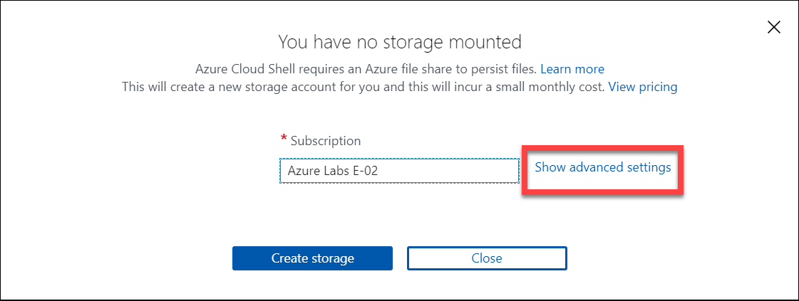
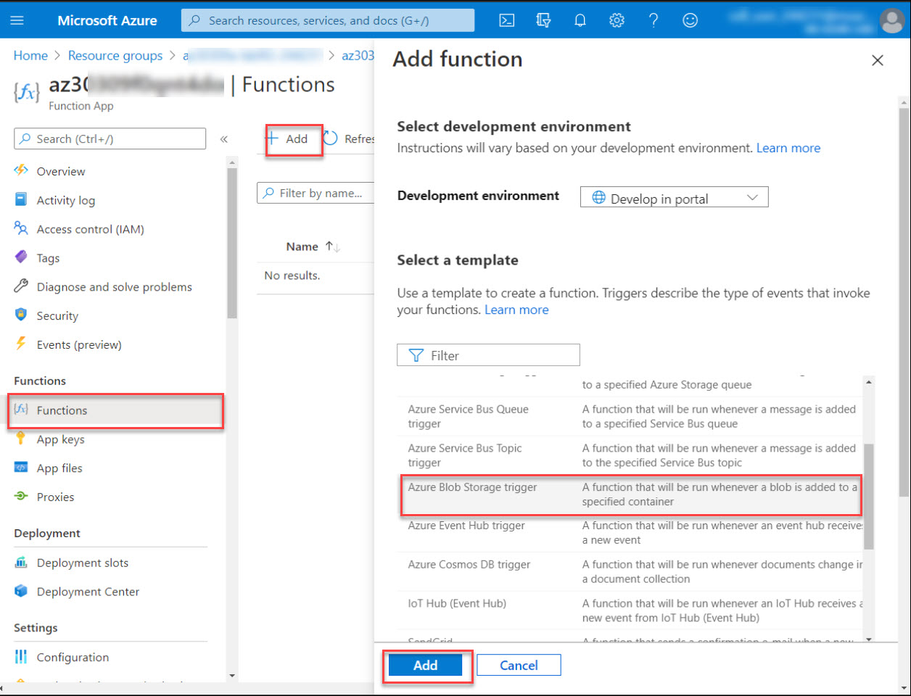
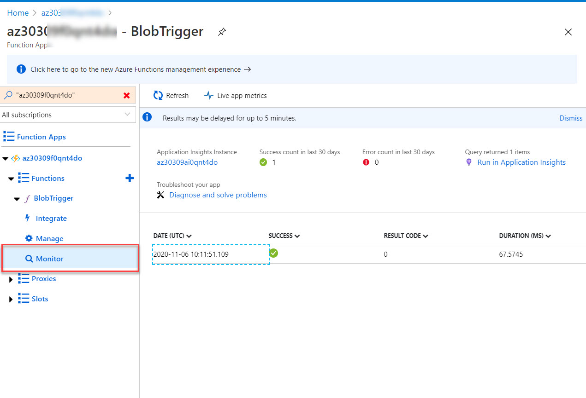

---
lab:
    title: '6: Configuring a Message-Based Integration Architecture'
    module: 'Module 6: Implement an Application Infrastructure'
---

# Lab: Configuring a Message-Based Integration Architecture
# Student lab manual

## Lab scenario

Adatum Corporation has several web applications that process files uploaded in regular intervals to their on-premises file servers. Files sizes vary, but they can reach up to 100 MB. Adatum is considering migrating the applications to Azure App Service or Azure Functions-based apps and using Azure Storage to host uploaded files. You plan to test two scenarios:

  - using Azure Functions to automatically process new blobs uploaded to an Azure Storage container.

  - using Event Grid to generate Azure Storage queue messages that will reference new blobs uploaded to an Azure Storage container.

These scenarios are intended to address a challenge common to a messaging-based architecture, when sending, receiving, and manipulating large messages. Sending large messages to a message queue directly is not recommended as they would require more resources to be used, result in more bandwidth to be consumed, and negatively impact the processing speed, since messaging platforms are usually fine-tuned to handle high volumes of small messages. In addition, messaging platforms usually limit the maximum message size they can process.

One potential solution is to store the message payload into an external service, like Azure Blob Store, Azure SQL or Azure Cosmos DB, get the reference to the stored payload and then send to the message bus only that reference. This architectural pattern is known as "claim check". The clients interested in processing that specific message can use the obtained reference to retrieve the payload, if needed. 

On Azure this pattern can be implemented in several ways and with different technologies, but it typically it relies on events to either automate the claim check generation and to push it into the message bus to be used by clients or to trigger payload processing directly. One of the common components included in such implementations is Event Grid, which is an event routing service responsible for delivery of events within a configurable period (up to 24 hours). After that, events are either discarded or dead lettered. If archival of event contents or replayability of event stream are needed, it is possible to facilitate this requirement by setting up an Event Grid subscription to the Event Hub or a queue in Azure Storage where messages can be retained for longer periods and archival of messages is supported.

In this lab, you will use Azure Storage Blob service to store files to be processed. A client just needs to drop the files to be shared into a designated Azure Blob container. In the first exercise, the files will be consumed directly by an Azure Function, leveraging its serverless nature. You will also take advantage of the Application Insights to provide instrumentation, facilitating monitoring and analyzing file processing. In the second exercise, you will use Event Grid to automatically generate a claim check message and send it to an Azure Storage queue. This allows a client application to poll the queue, get the message and then use the stored reference data to download the payload directly from Azure Blob Storage. 

It is worth noting that the Azure Function in the first exercise relies on the Blob Storage trigger. You should opt for Event Grid trigger instead of the Blob storage trigger when dealing with the following requirements:

  - blob-only storage accounts: blob storage accounts are supported for blob input and output bindings but not for blob triggers. Blob storage triggers require a general-purpose storage account.

  - high scale: high scale can be loosely defined as containers that have more than 100,000 blobs in them or storage accounts that have more than 100 blob updates per second.

  - reduced latency: if your function app is on the Consumption plan, there can be up to a 10-minute delay in processing new blobs if a function app has gone idle. To avoid this latency, you can use an Event Grid trigger or switch to an App Service plan with the Always On setting enabled. 

  - processing of blob delete events: blob delete events are not supported by blob storage triggers.


## Objectives
  
After completing this lab, you will be able to:

-  Configure and validate an Azure Function App Storage Blob trigger

-  Configure and validate an Azure Event Grid subscription-based queue messaging 


## Lab Environment
  
Estimated Time: 60 minutes


## Lab Files

None

## Instructions

### Exercise 1: Configure and validate an Azure Function App Storage Blob trigger
  
The main tasks for this exercise are as follows:

1. Configure an Azure Function App Storage Blob trigger

1. Validate an Azure Function App Storage Blob trigger


#### Task 1: Configure an Azure Function App Storage Blob trigger

1. From your lab computer, start a web browser, navigate to the [Azure portal](https://portal.azure.com), and sign in by providing credentials of a user account in Environment Detail page.

2. In the Azure portal, open **Cloud Shell** pane by selecting on the toolbar icon directly to the right of the search textbox.

    

3. If prompted to select either **Bash** or **PowerShell**, select **PowerShell**. 

    >**Note**: If this is the first time you are starting **Cloud Shell** and you are presented with the **You have no storage mounted** message, select the subscription you are using in this lab, and select **Show Advanced Settings**.

   
   
   1. **While selecting the resource group please select AZ30307C-LABRG-DEPLOYMENTID**
   
   

4. From the Cloud Shell pane, run the following to generate a pseudo-random string of characters that will be used as a prefix for names of resources you will provision in this exercise:

   ```sh
   export PREFIX=$(echo `openssl rand -base64 5 | cut -c1-7 | tr '[:upper:]' '[:lower:]' | tr -cd '[[:alnum:]]._-'`)
   ```

5. From the Cloud Shell pane, run the following to designate the Azure region into which you want to provision resources in this lab (replace the `<Azure region>` placeholder with the name of the Azure region that is available in your subscription and which is closest to the location of your lab computer):

   ```sh
   export LOCATION='<Azure region>'
   ```

6. From the Cloud Shell pane, run the following to create a variable storing the value of resource group that will host all resources that you will provision in this lab:

` Note : Replace the Deployment-id with your deploymnet id given in environment detail page`

   ```sh
   export RESOURCE_GROUP_NAME='az30309a-labRG-Deployment-ID'
   ```

7. From the Cloud Shell pane, run the following to create an Azure Storage account that will host container with blobs to be processed by the Azure function:

   ```sh
   export STORAGE_ACCOUNT_NAME="az30309a${PREFIX}"

   export CONTAINER_NAME="workitems"

   export STORAGE_ACCOUNT=$(az storage account create --name "${STORAGE_ACCOUNT_NAME}" --kind "StorageV2" --location "${LOCATION}" --resource-group "${RESOURCE_GROUP_NAME}" --sku "Standard_LRS")
   ```

    > **Note**: The same storage account will be also used by the Azure function to facilitate its own processing requirements. In real-world scenarios, you might want to consider creating a separate storage account for this purpose.

8. From the Cloud Shell pane, run the following to create a variable storing the value of the connection string property of the Azure Storage account:

   ```sh
   export STORAGE_CONNECTION_STRING=$(az storage account show-connection-string --name "${STORAGE_ACCOUNT_NAME}" --resource-group "${RESOURCE_GROUP_NAME}" -o tsv)
   ```

9. From the Cloud Shell pane, run the following to create a container that will host blobs to be processed by the Azure function:

   ```sh
   az storage container create --name "${CONTAINER_NAME}" --account-name "${STORAGE_ACCOUNT_NAME}" --connection-string "${STORAGE_CONNECTION_STRING}"
   ```

10. From the Cloud Shell pane, run the following to create an Application Insights resource that will provide monitoring of the Azure Function processing blobs and store its key in a variable:

   ```sh
   export APPLICATION_INSIGHTS_NAME="az30309ai${PREFIX}"

   az resource create --name "${APPLICATION_INSIGHTS_NAME}" --location "${LOCATION}" --properties '{"Application_Type": "other", "ApplicationId": "function", "Flow_Type": "Redfield"}' --resource-group "${RESOURCE_GROUP_NAME}" --resource-type "Microsoft.Insights/components"

   export APPINSIGHTS_KEY=$(az resource show --name "${APPLICATION_INSIGHTS_NAME}" --query "properties.InstrumentationKey" --resource-group "${RESOURCE_GROUP_NAME}" --resource-type "Microsoft.Insights/components" -o tsv)
   ```

11. From the Cloud Shell pane, run the following to create the Azure Function that will process events corresponding to creation of Azure Storage blobs:

   ```sh
   export FUNCTION_NAME="az30309f${PREFIX}"

   az functionapp create --name "${FUNCTION_NAME}" --resource-group "${RESOURCE_GROUP_NAME}" --storage-account "${STORAGE_ACCOUNT_NAME}" --consumption-plan-location "${LOCATION}" --runtime "dotnet" --functions-version 2
   ```

12. From the Cloud Shell pane, run the following to configure Application Settings of the newly created function, linking it to the Application Insights and Azure Storage account:

   ```sh
   az functionapp config appsettings set --name "${FUNCTION_NAME}" --resource-group "${RESOURCE_GROUP_NAME}" --settings "APPINSIGHTS_INSTRUMENTATIONKEY=$APPINSIGHTS_KEY" FUNCTIONS_EXTENSION_VERSION=~2

   az functionapp config appsettings set --name "${FUNCTION_NAME}" --resource-group "${RESOURCE_GROUP_NAME}" --settings "STORAGE_CONNECTION_STRING=$STORAGE_CONNECTION_STRING" FUNCTIONS_EXTENSION_VERSION=~2
   ```

13. Switch to the Azure portal and navigate to the blade of the Azure Function app you created earlier in this task.

14. On the Azure Function app blade, select **Functions** and then, select **+ Add**. 

15. On the **New Function** blade, select **Azure Blob Storage trigger** template.

    

16. On the **New Function** blade, specify the following and select **Create Function** to create a new function within the Azure function:

    | Setting | Value | 
    | --- | --- |
    | Name | **BlobTrigger** |
    | Path | **workitems/{name}** |
    | Storage account connection | **STORAGE_CONNECTION_STRING** |

17. On the Azure Function app **BlobTrigger** function blade, select **Code + Test** and review the content of the run.csx file. 

   ```csharp
   public static void Run(Stream myBlob, string name, ILogger log)
   {
       log.LogInformation($"C# Blob trigger function Processed blob\n Name:{name} \n Size: {myBlob.Length} Bytes");
   }
   ```

    > **Note**: By default, the function is configured to simply log the event corresponding to creation of a new blob. In order to carry out blob processing tasks, you would modify the content of this file.


#### Task 2: Validate an Azure Function App Storage Blob trigger

1. If necessary, restart the Bash session in the Cloud Shell.

2. From the Cloud Shell pane, run the following to repopulate variables that you used in the previous task:

` Note : Replace the Deployment-id with your deployment id given in environment detail page`

   ```sh
   export RESOURCE_GROUP_NAME='az30309a-labRG-Deploymentid'

   export STORAGE_ACCOUNT_NAME="$(az storage account list --resource-group "${RESOURCE_GROUP_NAME}" --query "[0].name" --output tsv)"

   export CONTAINER_NAME="workitems"
   ```

3. From the Cloud Shell pane, run the following to upload a test blob to the Azure Storage account you created earlier in this task:

   ```sh
   export STORAGE_ACCESS_KEY="$(az storage account keys list --account-name "${STORAGE_ACCOUNT_NAME}" --resource-group "${RESOURCE_GROUP_NAME}" --query "[0].value" --output tsv)"

   export WORKITEM='workitem1.txt'

   touch "${WORKITEM}"

   az storage blob upload --file "${WORKITEM}" --container-name "${CONTAINER_NAME}" --name "${WORKITEM}" --auth-mode key --account-key "${STORAGE_ACCESS_KEY}" --account-name "${STORAGE_ACCOUNT_NAME}"
   ```
    
4. In the Azure portal, navigate back to the blade displaying the Azure Function app you created in the previous task.

5. On the Azure Function app blade, select **Switch to classic experience \| Continue to classic experience**.

6. On the Azure Function app blade, select **Monitor** entry. 

    
    
7. Note a single event entry representing uploading of the blob. Select the entry to view the **Invocation Details** blade.

    > **Note**: Since the Azure function app in this exercise runs in the Consumption plan, there may be a delay of up to several minutes between uploading a blob and the function being triggered. It is possible to minimize the latency by implementing the Function app by using an App Service (rather than Consumption) plan.

8. Go back to the **Monitor** blade, and select the link **Run query in Application Insights**.

    

9. In the Application Insights portal, review the autogenerated Kusto query and its results.


### Exercise 2: Configure and validate an Azure Event Grid subscription-based queue messaging 
  
The main tasks for this exercise are as follows:

1. Configure an Azure Event Grid subscription-based queue messaging

2. Validate an Azure Event Grid subscription-based queue messaging

3. Remove Azure resources deployed in the lab


#### Task 1: Configure an Azure Event Grid subscription-based queue messaging

1. If necessary, restart the Bash session in the Cloud Shell.

2. From the Cloud Shell pane, run the following to register the eventgrid resource provider in your subscription:

   ```sh
   az provider register --namespace microsoft.eventgrid
   ```
  
3. From the Cloud Shell pane, run the following to generate a pseudo-random string of characters that will be used as a prefix for names of resources you will provision in this exercise:

   ```sh
   export PREFIX=$(echo `openssl rand -base64 5 | cut -c1-7 | tr '[:upper:]' '[:lower:]' | tr -cd '[[:alnum:]]._-'`)
   ```

4. From the Cloud Shell pane, run the following to identify the Azure region hosting the target resource group and its existing resources: 

` Note : Replace the Deployment-id with your deploymnet id given in environment detail page`

   ```sh
   export RESOURCE_GROUP_NAME_EXISTING='az30309a-labRG-Deployment-id'

   export LOCATION=$(az group list --query "[?name == '${RESOURCE_GROUP_NAME_EXISTING}'].location" --output tsv)

   export RESOURCE_GROUP_NAME='az30309b-labRG-Deployment-id'

   az group create --name "${RESOURCE_GROUP_NAME}" --location $LOCATION
   ```

5. From the Cloud Shell pane, run the following to create an Azure Storage account that will host a container to be used by the Event Grid subscription that you will configure in this task:

   ```sh
   export STORAGE_ACCOUNT_NAME="az30309bst${PREFIX}"

   export CONTAINER_NAME="workitems"

   export STORAGE_ACCOUNT=$(az storage account create --name "${STORAGE_ACCOUNT_NAME}" --kind "StorageV2" --location "${LOCATION}" --resource-group "${RESOURCE_GROUP_NAME}" --sku "Standard_LRS")
   ```

6. From the Cloud Shell pane, run the following to create a variable storing the value of the connection string property of the Azure Storage account:

   ```sh
   export STORAGE_CONNECTION_STRING=$(az storage account show-connection-string --name "${STORAGE_ACCOUNT_NAME}" --resource-group "${RESOURCE_GROUP_NAME}" -o tsv)
   ```

7. From the Cloud Shell pane, run the following to create a container that will to be used by the Event Grid subscription:

   ```sh
   az storage container create --name "${CONTAINER_NAME}" --account-name "${STORAGE_ACCOUNT_NAME}" --connection-string "${STORAGE_CONNECTION_STRING}"
   ```

8. From the Cloud Shell pane, run the following to create a variable storing the value of the Resource Id property of the Azure Storage account:

   ```sh
   export STORAGE_ACCOUNT_ID=$(az storage account show --name "${STORAGE_ACCOUNT_NAME}" --query "id" --resource-group "${RESOURCE_GROUP_NAME}" -o tsv)
   ```

9. From the Cloud Shell pane, run the following to create the Storage Account queue that will store messages generated by the Event Grid subscription that you will configure in this task:

   ```sh
   export QUEUE_NAME="az30309bq${PREFIX}"

   az storage queue create --name "${QUEUE_NAME}" --account-name "${STORAGE_ACCOUNT_NAME}" --connection-string "${STORAGE_CONNECTION_STRING}"
   ```

10. From the Cloud Shell pane, run the following to create the Event Grid subscription that will facilitate generation of messages in Azure Storage queue in response to blob uploads to the designated container in the Azure Storage account:

   ```sh
   export QUEUE_SUBSCRIPTION_NAME="az30309bqsub${PREFIX}"

   az eventgrid event-subscription create --name "${QUEUE_SUBSCRIPTION_NAME}" --included-event-types 'Microsoft.Storage.BlobCreated' --endpoint "${STORAGE_ACCOUNT_ID}/queueservices/default/queues/${QUEUE_NAME}" --endpoint-type "storagequeue" --source-resource-id "${STORAGE_ACCOUNT_ID}"
   ```


#### Task 2: Validate an Azure Event Grid subscription-based queue messaging

1. From the Cloud Shell pane, run the following to upload a test blob to the Azure Storage account you created earlier in this task:

   ```sh
   export AZURE_STORAGE_ACCESS_KEY="$(az storage account keys list --account-name "${STORAGE_ACCOUNT_NAME}" --resource-group "${RESOURCE_GROUP_NAME}" --query "[0].value" --output tsv)"

   export WORKITEM='workitem2.txt'

   touch "${WORKITEM}"

   az storage blob upload --file "${WORKITEM}" --container-name "${CONTAINER_NAME}" --name "${WORKITEM}" --auth-mode key --account-key "${AZURE_STORAGE_ACCESS_KEY}" --account-name "${STORAGE_ACCOUNT_NAME}"
   ```
2. In the Azure portal, navigate to the blade displaying the Azure Storage account you created in the previous task of this exercise. 

3. On the blade of the Azure Storage account, select **Queues** to display the list of its queues. 

4. Select the entry representing the queue you created in the previous task of this exercise.

5. Note that the queue contains a single message. Select its entry to display the **Message properties** blade. 

6. In the **MESSAGE BODY**, note the value of the **url** property, representing the URL of the Azure Storage blob you uploaded in the previous task.


#### Task 3: Remove Azure resources deployed in the lab

1. From the Cloud Shell pane, run the following to list the resource group you created in this exercise:

   ```sh
   az group list --query "[?starts_with(name,'az30309')]".name --output tsv
   ```

    > **Note**: Verify that the output contains only the resource group you created in this lab. This group will be deleted in this task.

2. From the Cloud Shell pane, run the following to delete the resource group you created in this lab

   ```sh
   az group list --query "[?starts_with(name,'az30309')]".name --output tsv | xargs -L1 bash -c 'az group delete --name $0 --no-wait --yes'
   ```

3. Close the Cloud Shell pane.
