---
lab:
    title: '2: Implementing and Configuring Azure Storage File and Blob Services'
    module: 'Module 2: Implement Storage Accounts'
---

# Lab: Implementing and Configuring Azure Storage File and Blob Services
# Student lab manual

## Lab scenario
 
Adatum Corporation hosts large amounts of unstructured and semi-structured data in its on-premises storage. Its maintenance becomes increasingly complex and costly. Some of the data is preserved for extensive amount of time to address data retention requirements. The Adatum Enterprise Architecture team is looking for inexpensive alternatives that would support tiered storage, while, at the same time allow for secure access that minimizes the possibility of data exfiltration. While the team is aware of practically unlimited capacity offered by Azure Storage, it is concerned about the usage of account keys, which grant unlimited access to the entire content of the corresponding storage accounts. While keys can be rotated in an orderly manner, such operation needs to be carried out with proper planning. In addition, access keys constitute exclusively an authorization mechanism, which limits the ability to properly audit their usage.

To address these shortcomings, the Architecture team decided to explore the use of shared access signatures. A shared access signature (SAS) provides secure delegated access to resources in a storage account while minimizing the possibility of unintended data exposure. SAS offers granular control over data access, including the ability to limit access to an individual storage object, such as a blob, restricting such access to a custom time window, as well as filtering network access to a designated IP address range. In addition, the Architecture team wants to evaluate the level of integration between Azure Storage and Azure Active Directory, hoping to address its audit requirements. The Architecture team also decided to determine suitability of Azure Files as an alternative to some of its on-premises file shares.

To accomplish these objectives, Adatum Corporation will test a range of authentication and authorization mechanisms for Azure Storage resources, including:

-  Using shared access signatures on the account, container, and object-level

-  Configuring access level for blobs 

-  Implementing Azure Active Directory based authorization

-  Using storage account access keys


## Objectives
  
After completing this lab, you will be able to:

-  Implement authorization of Azure Storage blobs by leveraging shared access signatures

-  Implement authorization of Azure Storage blobs by leveraging Azure Active Directory

-  Implement authorization of Azure Storage file shares by leveraging access keys

Estimated Time: 90 minutes

## Lab Files

-  C:\AllFiles\AZ-303-Microsoft-Azure-Architect-Technologies-master\Allfiles\Labs\\02\\azuredeploy30302suba.json

-  C:\AllFiles\AZ-303-Microsoft-Azure-Architect-Technologies-master\Allfiles\Labs\\02\\azuredeploy30302rga.json

-  C:\AllFiles\AZ-303-Microsoft-Azure-Architect-Technologies-master\Allfiles\Labs\\02\\azuredeploy30302rga.parameters.json


### Exercise 0: Prepare the lab environment

The main tasks for this exercise are as follows:

 1. Deploy an Azure VM by using an Azure Resource Manager template


#### Task 1: Deploy an Azure VM by using an Azure Resource Manager template

1. In the Azure portal, open **Cloud Shell** pane by selecting on the toolbar icon directly to the right of the search textbox.

    

1. If prompted to select either **Bash** or **PowerShell**, select **PowerShell**.

    >**Note**: If this is the first time you are starting **Cloud Shell** and you are presented with the **You have no storage mounted** message, select the subscription you are using in this lab, and select **Create storage**.

    
    
    

1. In the toolbar of the Cloud Shell pane, select the **Upload/Download files** icon, in the drop-down menu select **Upload**.

    

1. From the Cloud Shell pane, upload the Azure Resource Manager template **C:\AllFiles\AZ-303-Microsoft-Azure-Architect-Technologies-master\AllFiles\Labs\02\azuredeploy30302rga.json**.

    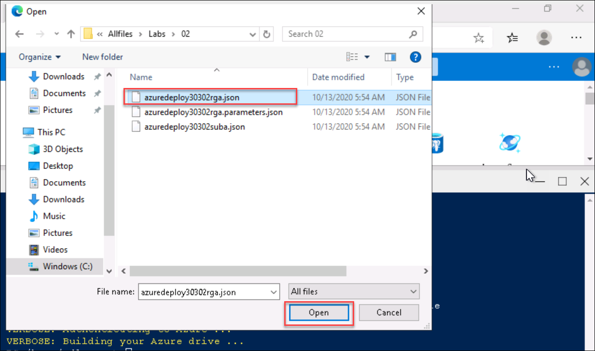

1. From the Cloud Shell pane, upload the Azure Resource Manager parameter file **C:\AllFiles\AZ-303-Microsoft-Azure-Architect-Technologies-master\AllFiles\Labs\02\azuredeploy30302rga.parameters.json**.

    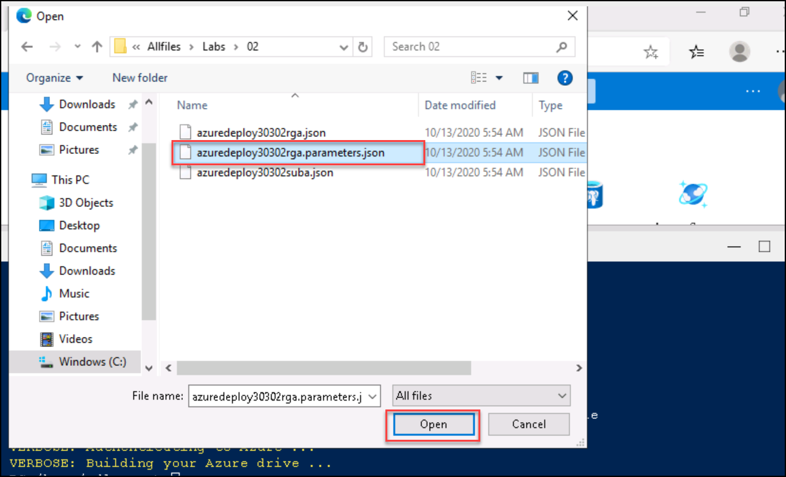

1. From the Cloud Shell pane, run the following to deploy a Azure VM running Windows Server 2019 that you will be using in this lab:

   ```powershell
   New-AzResourceGroupDeployment `
     -Name az30302rgaDeployment `
     -ResourceGroupName 'az30302a-labRG' `
     -TemplateFile $HOME/azuredeploy30302rga.json `
     -TemplateParameterFile $HOME/azuredeploy30302rga.parameters.json `
     -AsJob
   ```

    > **Note**: Do not wait for the deployment to complete but instead proceed to the next exercise. The deployment should take less than 5 minutes.

1. In the Azure portal, close the **Cloud Shell** pane. 


### Exercise 1: Configure Azure Storage account authorization by using shared access signature.
  
The main tasks for this exercise are as follows:

1. Create an Azure Storage account

1. Install Storage Explorer

1. Generate an account-level shared access signature

1. Create a blob container by using Azure Storage Explorer

1. Upload a file to a blob container by using AzCopy

1. Access a blob by using a blob-level shared access signature


#### Task 1: Create an Azure Storage account

1. In the Azure portal, search for and select **Storage accounts** and, on the **Storage accounts** blade, select **+ Add**.

    
    
    

1. On the **Basics** tab of the **Create storage account** blade, specify the following settings (leave others with their default values):

    | Setting | Value | 
    | --- | --- |
    | Subscription | the name of the Azure subscription you are using in this lab |
    | Resource group | the name of a new resource group **az30302a-labRG** |
    | Storage account name | any globally unique name between 3 and 24 in length consisting of letters and digits, For eg: **azstore**deploymentID |
    | Location | the name of an Azure region where you can create an Azure Storage account  |
    | Performance | **Standard** |
    | Account kind | **StorageV2 (general purpose v2)** |
    | Replication | **Locally redundant storage (LRS)** |

   

1. Select **Next: Networking >**, on the **Networking** tab of the **Create storage account** blade, review the available options, accept the default option **Public endpoint (all networks}** and select **Next: Data protection >**.

    

1. On the **Data protection** tab of the **Create storage account** blade, review the available options, accept the defaults, select **Next: Advanced >**.

    

1. On the **Advanced** tab of the **Create storage account** blade, review the available options, accept the defaults, select **Review + Create**, wait for the validation process to complete and select **Create**.

    >**Note**: Wait for the Storage account to be created. This should take about 2 minutes.

    

#### Task 2: Install Storage Explorer

   > **Note**: Ensure that the deployment of the Azure VM you initiated at the beginning of this lab has completed before you proceed. 

1. In the Azure portal, search for and select **Virtual machines**, and, on the **Virtual machines** blade, in the list of virtual machines, select **az30302a-vm0**.

    
    
    

1. On the **az30302a-vm0** blade, select **Connect**, in the drop-down menu, select **RDP**, and then select **Download RDP File**.

    

1. When prompted, sign in with the following credentials:

    | Setting | Value | 
    | --- | --- |
    | User Name | **Student** |
    | Password | **Pa55w.rd1234** |

   
   
   
   
   
   
1. Within the Remote Desktop session to **az30302a-vm0**, in the Server Manager window, select **Local Server**, select the **On** link next to the **IE Enhanced Security Configuration** label, and, in the **IE Enhanced Security Configuration** dialog box, select both **Off** options.

    

1. Within the Remote Desktop session to **az30302a-vm0**, start Internet Explorer and navigate to the download page of [Azure Storage Explorer](https://azure.microsoft.com/en-us/features/storage-explorer/) or navigate to (https://azure.microsoft.com/en-us/features/storage-explorer/)

    

1. Within the Remote Desktop session to **az30302a-vm0**, download and install Azure Storage Explorer with the default settings. 


#### Task 3: Generate an account-level shared access signature

1. Within the Remote Desktop session to **az30302a-vm0**, start Internet Explorer, navigate to the [Azure portal](https://portal.azure.com), and sign-in by providing credentials of the user account with the Owner role in the subscription you are using in this lab.

1. Navigate to the blade of the newly created storage account, select **Access keys** and review the settings of the target blade.

   

    >**Note**: Each storage account has two keys which you can independently regenerate. Knowledge of the storage account name and either of the two keys provides full access to the entire storage account. 

1. On the storage account blade, select **Shared access signature** and review the settings of the target blade.

1. On the resulting blade, specify the following settings (leave others with their default values):

    | Setting | Value | 
    | --- | --- |
    | Allowed services | **Blob** |
    | Allowed resource types | **Service** and **Container** |
    | Allowed permissions | **Read**, **List** and **Create** |
    | Blob versioning permissions | disabled |
    | Start | 24 hours before the current time in your current time zone | 
    | End | 24 hours after the current time in your current time zone |
    | Allowed protocols | **HTTPS only** |
    | Signing key | **key1** |

   

1. Select **Generate SAS and connection string**.

    

1. Copy the value of **Blob service SAS URL** into Clipboard.

    

#### Task 4: Create a blob container by using Azure Storage Explorer

1. Within the Remote Desktop session to **az30302a-vm0**, start Azure Storage Explorer. 

1. In the Azure Storage Explorer window, in the **Connect to Azure Storage** window, select **Use a shared access signature (SAS) URI** and select **Next**.

    

1. In the **Attach with SAS URI** window, in the **Display name** text box, type **az30302a-blobs**, in the **URI** text box, paste the value you copied into Clipboard, and select **Next**. 

    >**Note**: This should automatically populate the value of **Blob endpoint** text box.

   

1. In the **Connection Summary** window, select **Connect**. 

1. In the Azure Storage Explorer window, in the **EXPLORER** pane, navigate to the **az30302a-blobs** entry, expand it and note that you have access to **Blob Container** endpoint only. 

    

1. Right select the **az30302a-blobs** entry, in the right-click menu, select **Create Blob Container**, and use the empty text box to set the container name to **container1** and press enter.

    
    
    

1. Select **container1**, in the **container1** pane, select **Upload**, and in the drop-down list, select **Upload Files**.

    
    
    

1. In the **Upload Files** window, select the ellipsis button next to the **Selected files** label, in the **Choose files to upload** window, select **C:\Windows\system.ini**, and select **Open**.

    

1. Back in the **Upload Files** window,  select **Upload** and note the error message displayed in the **Activities** list. 

    
    
    

    >**Note**: This is expected, since the shared access signature does not provide object-level permissions. 

1. Leave the Azure Storage Explorer window open.


#### Task 5: Upload a file to a blob container by using AzCopy

1. Within the Remote Desktop session to **az30302a-vm0**, in the browser window, on the **Shared access signature** blade, specify the following settings (leave others with their default values):

    | Setting | Value | 
    | --- | --- |
    | Allowed services | **Blob** |
    | Allowed resource types | **Object** |
    | Allowed permissions | **Read**, **Create** |
    | Blob versioning permissions | disabled |
    | Start | 24 hours before the current time in your current time zone | 
    | End | 24 hours after the current time in your current time zone |
    | Allowed protocols | **HTTPS only** |
    | Signing key | **key1** |

   

1. Select **Generate SAS and connection string**.

1. Copy the value of **SAS token** into Clipboard.

    

1. In the Azure portal, open **Cloud Shell** pane by selecting on the toolbar icon directly to the right of the search textbox.

1. If prompted to select either **Bash** or **PowerShell**, select **PowerShell**. 

1. From the Cloud Shell pane, run the following to create a file and add a line of text into it:

   ```powershell
   New-Item -Path './az30302ablob.html'

   Set-Content './az30302ablob.html' '<h3>Hello from az30302ablob via SAS</h3>'
   ```

   
1. From the Cloud Shell pane, run the following to upload the newly created file as a blob into container1 of the Azure Storage account you created earlier in this exercise (replace the `<sas_token>` placeholder with the value of the shared access signature you copied to Clipboard earlier in this task):(**Please check the storage account and confirm it is the one you created in Exercise 1 -> Task 1: Create an Azure Storage account and please do not use the storage account created in exercise 0 here**)

   ```powershell
   $storageAccountName = "replace here with the storage account name you created in exercise 1 -> task 1 -> step 2"

   azcopy cp './az30302ablob.html' "https://$storageAccountName.blob.core.windows.net/container1/az30302ablob.html<sas_token>"
   ```
   
1. Review the output generated by azcopy and verify that the job completed successfully.

1. Close the Cloud Shell pane.

1. Within the Remote Desktop session to **az30302a-vm0**, in the browser window, on the storage account blade, in the **Blob service** section, select **Containers**.

1. In the list of containers, select **container1**.

1. On the **container1** blade, verify that **az30302ablob.html** appears in the list of blobs. **If not able to find please refresh and check**

    

#### Task 6: Access a blob by using a blob-level shared access signature

1. Within the Remote Desktop session to **az30302a-vm0**, in the browser window, on the **container1** blade, select **Change access level**, verify that is set to **Private (no anonymous access)**, and select **Cancel**.

   
   
   

    >**Note**: If you want to allow anonymous access, you can set the public access level to **Blob (anonymous read access for blobs only)** or **Container (anonymous read access for containers and blobs)**.

1. On the **container1** blade, select **az30302ablob.html**.

1. On the **az30302ablob.html** blade, select **Generate SAS**, review the available options without modifying them, and then select **Generate SAS token and URL**.

    
    
    

1. Copy the value of the **Blob SAS URL** into Clipboard.

    

1. Open a new tab in the browser window and navigate to the URL you copied into Clipboard in the previous step.

    

1. Verify that the message **Hello from az30302ablob via SAS** appears in the browser window.

    

### Exercise 2: Configure Azure Storage blob service authorization by using Azure Active Directory
  
The main tasks for this exercise are as follows:

1. Create an Azure AD user

1. Enable Azure Active Directory authorization for Azure Storage blob service

1. Upload a file to a blob container by using AzCopy


#### Task 1: Create an Azure AD user

1. Within the Remote Desktop session to **az30302a-vm0**, in the browser window, open **PowerShell** session within a **Cloud Shell** pane.

1. From the Cloud Shell pane, run the following to explicitly authenticate to your Azure AD tenant:

   ```powershell
   Connect-AzureAD
   ```
   
1. From the Cloud Shell pane, run the following to identify the Azure AD DNS domain name:

   ```powershell
   $domainName = ((Get-AzureAdTenantDetail).VerifiedDomains)[0].Name
   ```

1. From the Cloud Shell pane, run the following to create a new Azure AD user:

   ```powershell
   $passwordProfile = New-Object -TypeName Microsoft.Open.AzureAD.Model.PasswordProfile
   $passwordProfile.Password = 'Pa55w.rd1234'
   $passwordProfile.ForceChangePasswordNextLogin = $false
   New-AzureADUser -AccountEnabled $true -DisplayName 'az30302auser1' -PasswordProfile $passwordProfile -MailNickName 'az30302auser1' -UserPrincipalName "az30302auser1@$domainName"
   ```

1. From the Cloud Shell pane, run the following to identify the user principal name of the newly created Azure AD user:

   ```powershell
   (Get-AzureADUser -Filter "MailNickName eq 'az30302auser1'").UserPrincipalName
   ```

1. Note the user principal name. You will need it later in this exercise. 

    

1. Close the Cloud Shell pane.


#### Task 2: Enable Azure Active Directory authorization for Azure Storage blob service

1. Within the Remote Desktop session to **az30302a-vm0**, in the browser window displaying the Azure portal, navigate back to the **container1** blade.

1. On the **container1** blade, select **Switch to Azure AD User Account**.

    

1. Note the error message indicating that you no longer have permissions to list data in the blob container. This is expected.

    >**Note**: Despite having the **Owner** role in the subscription, you also need to be assigned either built-in or a custom role that provides access to the blob content of the storage account, such as **Storage Blob Data Owner**, **Storage Blob Data Contributor**, or **Storage Blob Data Reader**.

   
   
1. In the Azure portal, navigate back to the blade of the storage account hosting **container1**, select **Access control (IAM)**, select **+ Add**, and, in the drop-down list, select **Add role assignment**. 

   
   
   

    >**Note**: Write down the name of the storage account. You will need it in the next task.

1. On the **Add role assignment** blade, in the **Role** drop-down list, select **Storage Blob Data Owner**, ensure that the **Assign access to** drop-down list entry is set to **Azure AD user, group, or service principal**, select both your user account and the user account you created in the previous task from the list displayed below the **Select** text box, and select **Save**.

    
    
    

1. Navigate back to the **container1** blade and verify that you can see the content of the container.

    
    
    

#### Task 3: Upload a file to a blob container by using AzCopy

1. Within the Remote Desktop session to **az30302a-vm0**, in the browser window, navigate to [Get started with AzCopy](https://docs.microsoft.com/en-us/azure/storage/common/storage-use-azcopy-v10) or navigate to (https://docs.microsoft.com/en-us/azure/storage/common/storage-use-azcopy-v10).

    

1. Download the azcopy.zip file and extract azcopy.exe into the **C:\\Labfiles** folder (create the folder if needed).

1. Within the Remote Desktop session to **az30302a-vm0**, start Windows PowerShell. 

1. From the Windows PowerShell prompt, run the following to download the **azcopy.zip** archive, extract its content, and switch to the location containing **azcopy.exe**:

   ```powershell
   $url = 'https://aka.ms/downloadazcopy-v10-windows'
   $zipFile = '.\azcopy.zip'

   Invoke-WebRequest -Uri $Url -OutFile $zipFile

   Expand-Archive -Path $zipFile -DestinationPath '.\'

   Set-Location -Path 'azcopy*'
   ```

1. From the Windows PowerShell prompt, run the following to authenticate AzCopy by using the Azure AD user account you created in the first task of this exercise. 

   ```powershell
   .\azcopy.exe login
   ```

    >**Note**: You cannot use for this purpose a Microsoft account, which is the reason that Azure AD user account had to be created first.

1. Follow instructions provided in the message generated by the command you run in the previous step to authenticate as the **az30302auser1** user account. When prompted for credentials, provide the user principal name of the account you noted in the first task of this exercise and its password **Pa55w.rd1234**.

    
    
    
    
    

1. Once you successfully authenticated, from the Windows PowerShell prompt, run the following to create a file you will upload to **container1**:

   ```powershell
   New-Item -Path './az30302bblob.html'

   Set-Content './az30302bblob.html' '<h3>Hello from az30302bblob via Azure AD</h3>'
   ```

1. From the the Windows PowerShell prompt, run the following to upload the newly created file as a blob into **container1** of the Azure Storage account you created in the previous exercise (replace the `<storage_account_name>` placeholder with the value of the storage account you noted in the previous task or the one you created in Exercise 1 -> Task1 -> step2):

   ```powershell
   .\azcopy cp './az30302bblob.html' 'https://<storage_account_name>.blob.core.windows.net/container1/az30302bblob.html'
   ```

1. Review the output generated by azcopy and verify that the job completed successfully.

1. From the Windows PowerShell prompt and run the following to verify that you do not have access to the uploaded blob outside of the security context provided by the AzCopy utility (replace the `<storage_account_name>` placeholder with the value of the storage account you noted in the previous task or the one you created in Exercise 1 -> Task1 -> step2): (**May see some errors but it is expected and please continue**)

   ```powershell
   Invoke-WebRequest -Uri 'https://<storage_account_name>.blob.core.windows.net/container1/az30302bblob.html'
   ```

1. Within the Remote Desktop session to **az30302a-vm0**, in the browser window, navigate back to **container1**.

1. On the **container1** blade, verify that **az30302bblob.html** appears in the list of blobs.

    

1. On the **container1** blade, select **Change access level**, set the public access level to **Blob (anonymous read access for blobs only)** and select **OK**. 

    

1. Switch back to the Windows PowerShell prompt and re-run the following command to verify that now you can access the uploaded blob anonymously (replace the `<storage_account_name>` placeholder with the value of the storage account you noted in the previous task): (**May see some errors but it is expected and please continue**)

   ```powershell
   Invoke-WebRequest -Uri 'https://<storage_account_name>.blob.core.windows.net/container1/az30302bblob.html'
   ```
  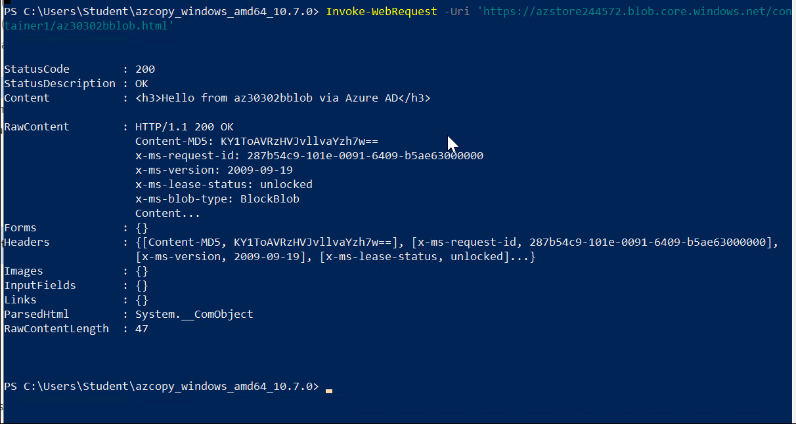

### Exercise 3: Implement Azure Files.
  
The main tasks for this exercise are as follows:

1. Create an Azure Storage file share

1. Map a drive to an Azure Storage file share from Windows

1. Remove Azure resources deployed in the lab


#### Task 1: Create an Azure Storage file share

1. Within the Remote Desktop session to **az30302a-vm0**, in the browser window displaying the Azure portal, navigate back to the blade of the storage account you created in the first exercise of this lab and, in the **File service** section, select **File shares**.

    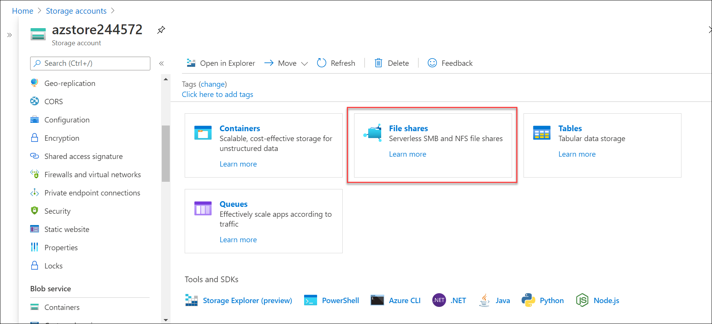
    
    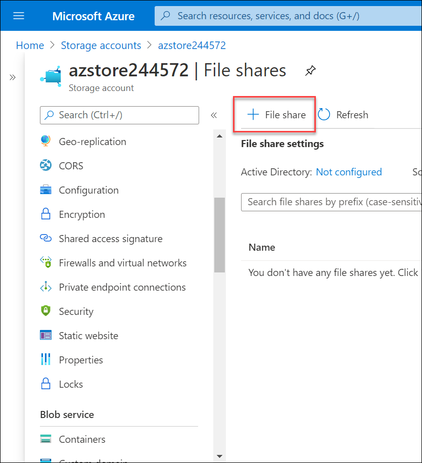

1. Select **+ File share** and create a file share with the following settings:

    | Setting | Value |
    | --- | --- |
    | Name | **az30302a-share** |
    | Quota | **1024** |

  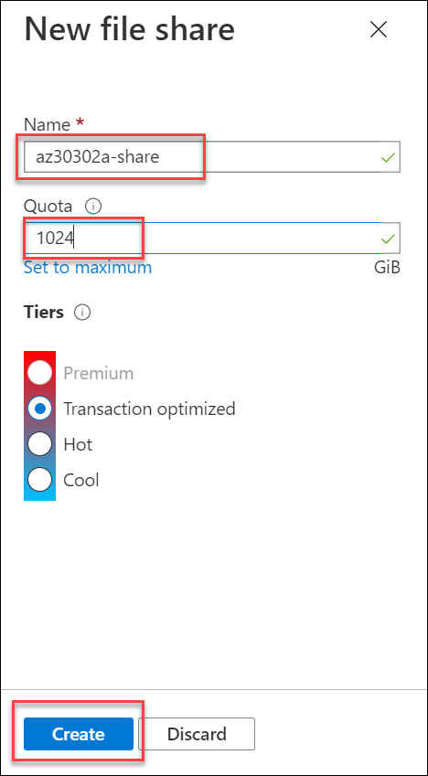

#### Task 2: Map a drive to an Azure Storage file share from Windows

1. Select the newly created file share and select **Connect**.

1. On the **Connect** blade, ensure that the **Windows** tab is selected, and select **Copy to clipboard**.

    >**Note**: Azure Storage file share mapping uses the storage account name and one of two storage account keys as the equivalents of user name and password, respectively in order to gain access to the target share.

   

1. Within the Remote Desktop session to **az30302a-vm0**, at the PowerShell prompt, paste and execute the script you copied.

    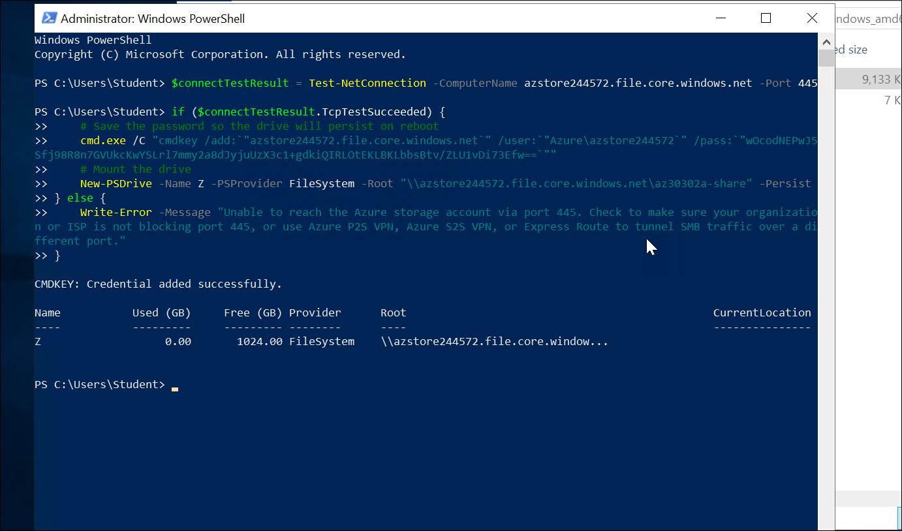

1. Verify that the script completed successfully. 

1. Start File Explorer, navigate to **Z:** drive and verify that the mapping was successful.

    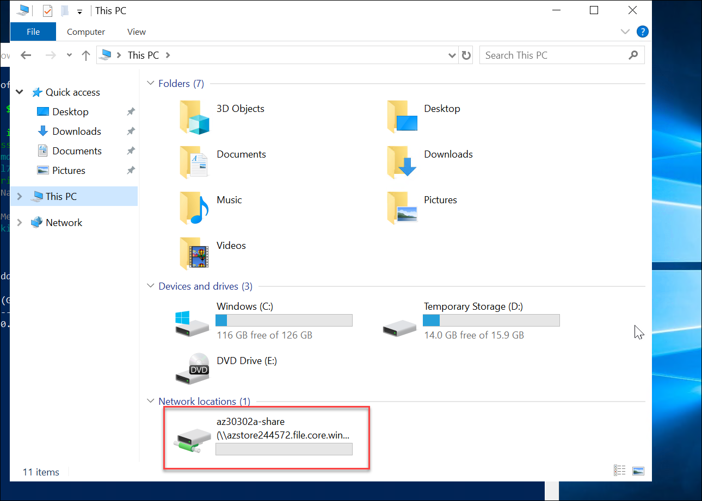

1. In File Explorer, create a folder named **Folder1** and a text file inside the folder named **File1.txt**.

    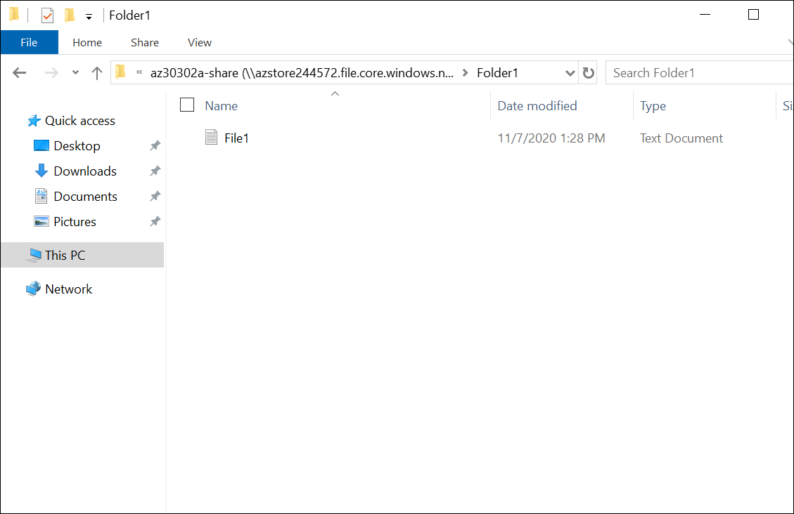

1. Switch back to the browser window displaying the Azure portal, on the **az30302a-share** blade, select **Refresh**, and verify that **Folder1** appears in the list of folders. 

    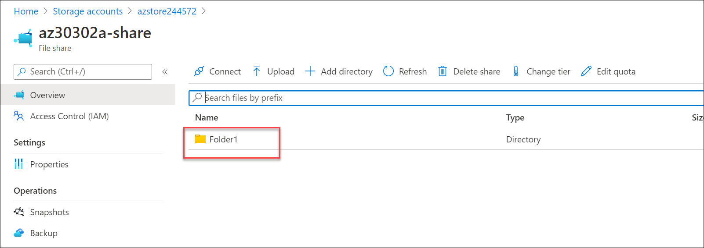

1. Select **Folder1** and verify that **File1.txt** appears in the list of files.

    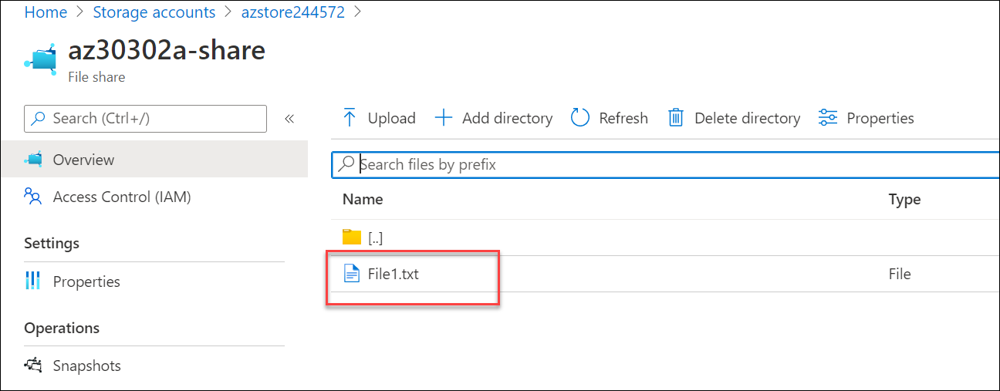
 
