---
lab:
    title: '4: Protecting Hyper-V VMs by using Azure Site Recovery'
    module: 'Module 4: Protecting Hyper-V VMs by using Azure Site Recovery'
---

# Lab: Protecting Hyper-V VMs by using Azure Site Recovery
# Student lab manual

## Lab scenario

While Adatum Corporation has, over the years, implemented a number of high availability provisions for their on-premises workloads, its disaster recovery capabilities are still insufficient to address the Recovery Point Objectives (RPOs) and Recovery Time Objectives (RTOs) demanded by its business. Maintaining the existing secondary on-premises site requires an extensive effort and incurs significant costs. The failover and failback procedures are, for the most part, manual and are poorly documented. 

To address these shortcomings, the Adatum Enterprise Architecture team decided to explore capabilities of Azure Site Recovery, with Azure taking on the role of the hoster of the secondary site. Azure Site Recovery automatically and continuously replicates workloads running on physical and virtual machines from the primary to the secondary site. Site Recovery uses storage-based replication mechanism, without intercepting application data. With Azure as the secondary site, data is stored in Azure Storage, with built-in resilience and low cost. The target Azure VMs are hydrated following a failover by using the replicated data. The Recovery Time Objectives (RTO) and Recovery Point objectives are minimized since Site Recovery provides continuous replication for VMware VMs and replication frequency as low as 30 seconds for Hyper-V VMs. In addition, Azure Site Recovery also handles orchestration of failover and failback processes, which, to large extent, can be automated. It is also possible to use Azure Site Recovery for migrations to Azure, although the recommended approach relies on Azure Migrate instead.

The Adatum Enterprise Architecture team wants to evaluate the use of Azure Site Recovery for protecting on-premises Hyper-V virtual machines to Azure VM.

## Objectives
  
After completing this lab, you will be able to:

-  Configure Azure Site Recovery

-  Perform test failover

-  Perform planned failover

-  Perform unplanned failover

Estimated Time: 120 minutes

## Lab Files

-  C:\AllFiles\AZ-303-Microsoft-Azure-Architect-Technologies-master\Allfiles\Labs\\07\\azuredeploy30307suba.json


### Exercise 0: Prepare the lab environment

The main tasks for this exercise are as follows:

1. Deploy an Azure VM by using an Azure Resource Manager QuickStart template

1. Configure nested virtualization in the Azure VM


#### Task 1: Deploy an Azure VM by using an Azure Resource Manager QuickStart template

1. From your lab computer, start a web browser, navigate to the [Azure portal](https://portal.azure.com), and sign in by provided credentials , you can find it in the environment details tab.

1. From your lab computer, open another browser tab, navigate to the [301-nested-vms-in-virtual-network Azure QuickStart template](https://github.com/Azure/azure-quickstart-templates/tree/master/301-nested-vms-in-virtual-network) or copy this link(https://github.com/Azure/azure-quickstart-templates/tree/master/301-nested-vms-in-virtual-network) and select **Deploy to Azure**. This will automatically redirect the browser to the **Hyper-V Host Virtual Machine with nested VMs** blade in the Azure portal.

1. On the **Hyper-V Host Virtual Machine with nested VMs** blade in the Azure portal, specify the following settings (leave others with their default values):

    | Setting | Value | 
    | --- | --- |
    | Subscription | the name of the Azure subscription you are using in this lab |
    | Resource group | **az30307a-labRG-deploymentID** |
    | Host Public IP Address Name | **az30307a-hv-vm-pip** |
    | Virtual Network Name | **az30307a-hv-vnet** |
    | Host Network Interface1Name | **az30307a-hv-vm-nic1** |
    | Host Network Interface2Name | **az30307a-hv-vm-nic2** |
    | Host Virtual Machine Name | **az30307a-hv-vm** |
    | Host Admin Username | **Student** |
    | Host Admin Password | **Pa55w.rd1234** |

1. On the **Hyper-V Host Virtual Machine with nested VMs** blade, select the checkbox **I agree to the terms and conditions above** and select **Purchase**.

    > **Note**: Wait for the deployment to complete. The deployment might take about 10 minutes.

#### Task 2: Configure nested virtualization in the Azure VM

1. In the Azure portal, search for and select **Virtual machines** and, on the **Virtual machines** blade, select **az30307a-hv-vm**.

1. On the **az30307a-hv-vm** blade, select **Networking**. 

1. On the **az30307a-hv-vm | Networking** blade, select **az30307a-hv-vm-nic1** and then select **Add inbound port rule**.

   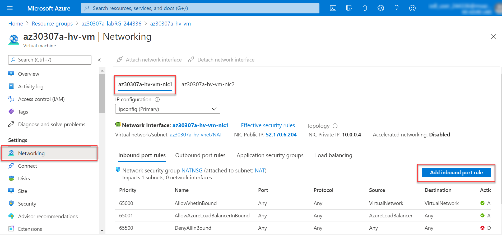

    >**Note**: Make sure that you modify the settings of **az30307a-hv-vm-nic1**, which has the public IP address assigned to it.

1. On the **Add inbound security rule** blade, specify the following settings (leave others with their default values) and select **Add**:

    | Setting | Value | 
    | --- | --- |
    | Destination port range | **3389** |
    | Protocol | **Any** |
    | Name | **AllowRDPInBound** |

    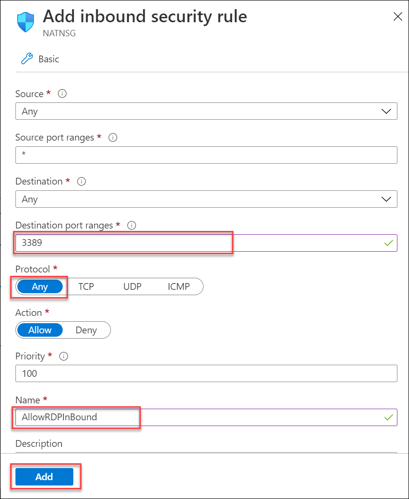
 
1. On the **az30307a-hv-vm** blade, select **Overview**.

    

1. On the **az30307a-hv-vm** blade, select **Connect**, in the drop-down menu, select **RDP**, and then click **Download RDP File**.

    

1. When prompted, sign in with the following credentials:

    - User Name: **Student**

    - Password: **Pa55w.rd1234**

1. Within the Remote Desktop session to **az30307a-hv-vm**, in the Server Manager window, click **Local Server**, click the **On** link next to the **IE Enhanced Security Configuration** label, and, in the **IE Enhanced Security Configuration** dialog box, select both **Off** options.

    

1. Please Create Two Folders in F: Drive with Names **VHDs** and **VMs** .

    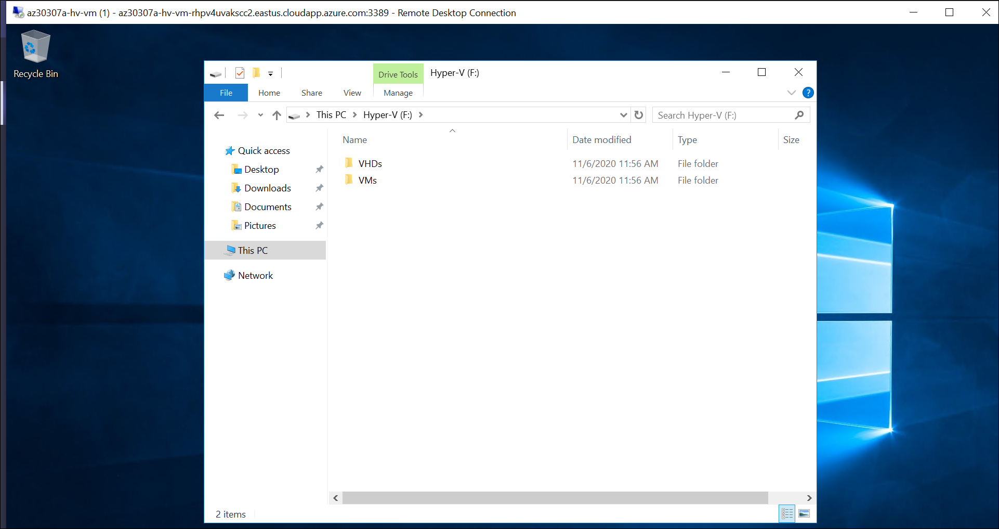

1. Within the Remote Desktop session to **az30307a-hv-vm**, start Internet Explorer, browse to [Windows Server Evaluations](https://www.microsoft.com/en-us/evalcenter/evaluate-windows-server-2019) OR (https://www.microsoft.com/en-us/evalcenter/evaluate-windows-server-2019), and download the Windows Server 2019 **VHD** file and move the file from downloads to **F:\VHDs** folder. 

    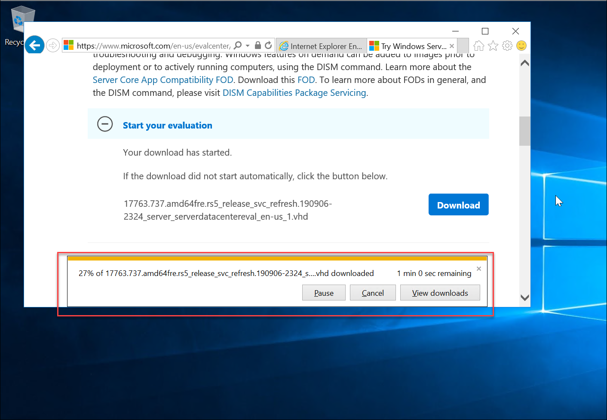

1. Within the Remote Desktop session to **az30307a-hv-vm**, start **Hyper-V Manager**. 

    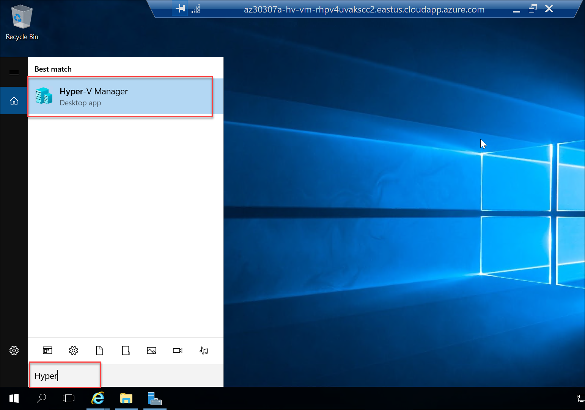

1. In the **Hyper-V Manager** console, select the **az30307a-hv-vm** node, select **New** and, in the cascading menu, select **Virtual Machine**. This will start the **New Virtual Machine Wizard**. 

    

1. On the **Before You Begin** page of the **New Virtual Machine Wizard**, select **Next >**.

1. On the **Specify Name and Location** page of the **New Virtual Machine Wizard**, specify the following settings and select **Next >**:

    | Setting | Value | 
    | --- | --- |
    | Name | **az30307a-vm1** | 
    | Store the virtual machine in a different location | selected | 
    | Location | **F:\VMs** |

    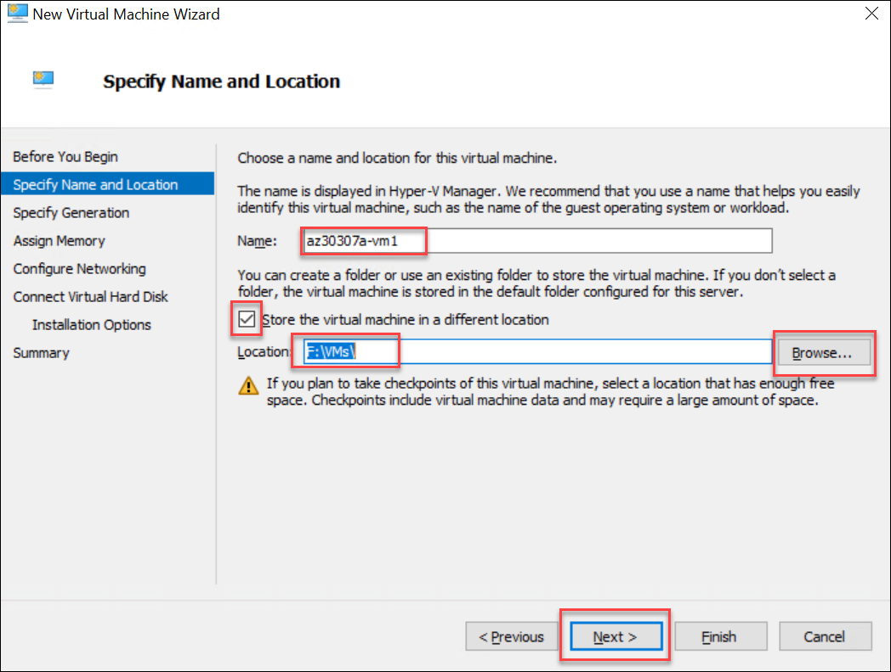

1. On the **Specify Generation** page of the **New Virtual Machine Wizard**, ensure that the **Generation 1** option is selected and select **Next >**:

1. On the **Assign Memory** page of the **New Virtual Machine Wizard**, set **Startup memory** to **2048** and select **Next >**.

1. On the **Configure Networking** page of the **New Virtual Machine Wizard**, in the **Connection** drop-down list select **NestedSwitch** and select **Next >**.

1. On the **Connect Virtual Hard Disk** page of the **New Virtual Machine Wizard**, select the option **Use an existing virtual hard disk**, set location to the VHD file you downloaded to the **F:\VHDs** folder, and select **Next >**.

    

1. On the **Summary** page of the **New Virtual Machine Wizard**, select **Finish**.

1. In the **Hyper-V Manager** console, select the newly created virtual machine and select **Start**. 

    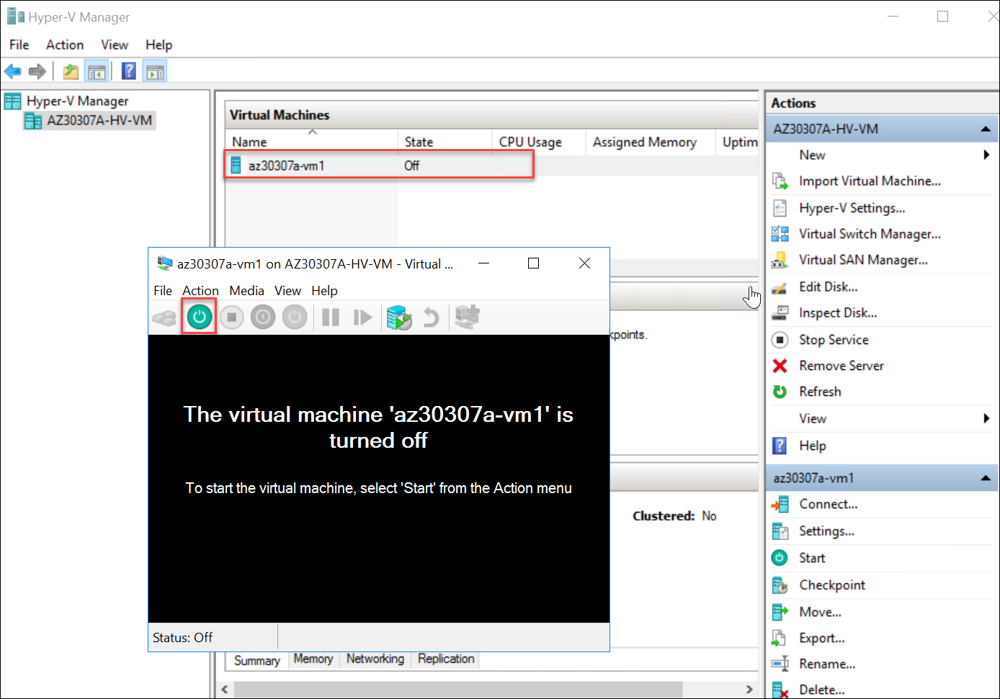

1. In the **Hyper-V Manager** console, verify that the virtual machine is running and select **Connect**. 

1. In the Virtual Machine Connection window to **az30307a-vm1**, on the **Hi there** page, select **Next**. 

1. In the Virtual Machine Connection window to **az30307a-vm1**, on the **License terms** page, select **Accept**. 

1. In the Virtual Machine Connection window to **az30307a-vm1**, on the **Customize settings** page, set the password of the built-in Administrator account to **Pa55w.rd1234** and select **Finish**. 

1. In the Virtual Machine Connection window to **az30307a-vm1**, sign in by using the newly set password. Use CTRL+ALT+DELETE button to login.

    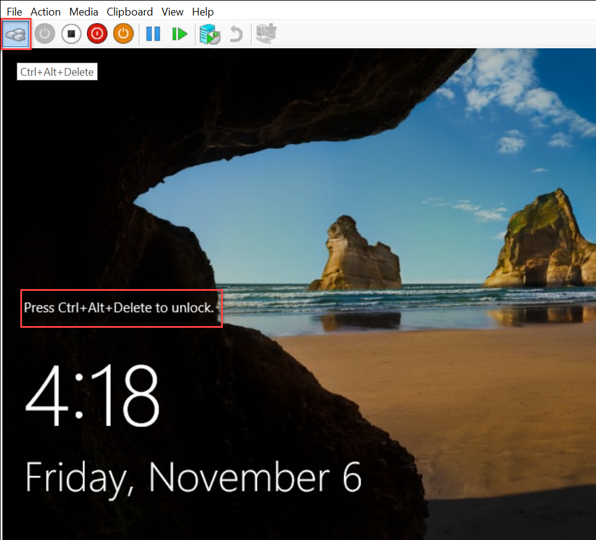

1. In the Virtual Machine Connection window to **az30307a-vm1**, start Windows PowerShell and, in the **Administrator: Windows PowerShell** window run the following to set the computer name. 

   ```powershell
   Rename-Computer -NewName 'az30307a-vm1' -Restart
   ```

### Exercise 1: Create and configure an Azure Site Recovery vault
  
The main tasks for this exercise are as follows:

1. Create an Azure Site Recovery vault

1. Configure the Azure Site Recovery vault


#### Task 1: Create an Azure Site Recovery vault

1. Within the Remote Desktop session to **az30307a-hv-vm**, start Internet Explorer, navigate to the [Azure portal](https://portal.azure.com), and sign in by providing credentials from environment detials tab.

1. In the Azure portal, search for and select **Recovery Services vaults** and, on the **Recovery Services vaults** blade, select **+ Add**.

    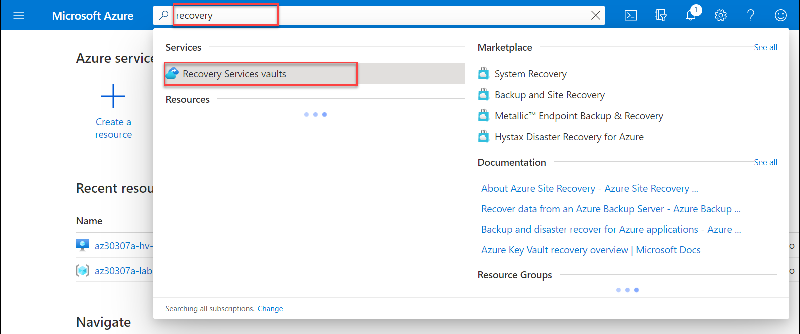

1. On the **Basics** tab of the **Create Recovery Services vault** blade, specify the following settings (leave others with their default values) and select **Review + create**:

    | Setting | Value | 
    | --- | --- |
    | Subscription | the name of the Azure subscription you are using in this lab |
    | Resource group | the name of a new resource group **az30307b-labRG-deploymentID** |
    | Vault name | **az30307b-rsvault** |
    | Location | the name of the Azure region into which you deployed the virtual machine earlier in this lab |

1. On the **Review + create** tab of the **Create Recovery Services vault** blade, select **Create**:

    >**Note**: By default, the default configuration for Storage Replication type is set to Geo-redundant (GRS) and Soft Delete is enabled. You will change these settings in the lab to simplify deprovisioning, but you should use them in your production environments.


   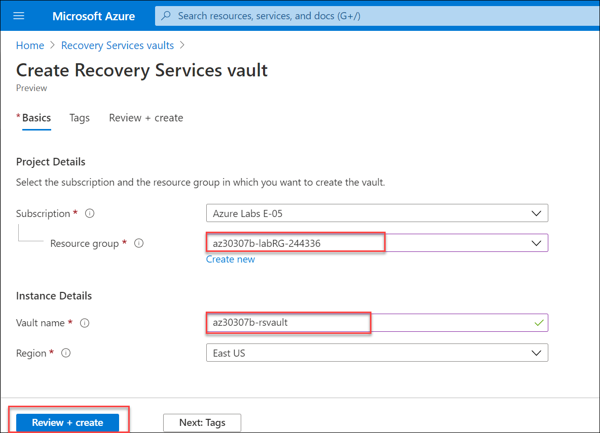


#### Task 2: Configure the Azure Site Recovery vault

1. In the Azure portal, search for and select **Recovery Services vaults** and, on the **Recovery Services vaults** blade, select **az30307b-rsvault**.

1. On the **az30307b-rsvault** blade, select **Properties**. 

1. On the **az30307b-rsvault | Properties** blade, select the **Update** link under the **Backup Configuration** label.

1. On the **Backup Configuration** blade, set **Storage replication type** to **Locally-redundant**, select **Save** and close the **Backup Configuration** blade.

    >**Note**: Storage replication type cannot be changed once you start protecting items.

   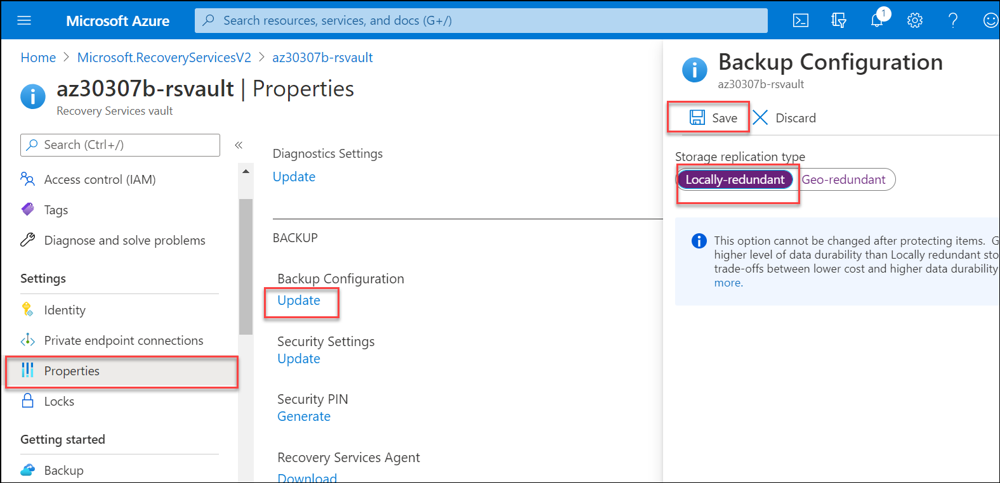

1. On the **az30307b-rsvault | Properties** blade, select the **Update** link under the **Security Settings** label.

1. On the **Security Settings** blade, set **Soft Delete** to **Disable**, select **Save** and close the **Security Settings** blade.

    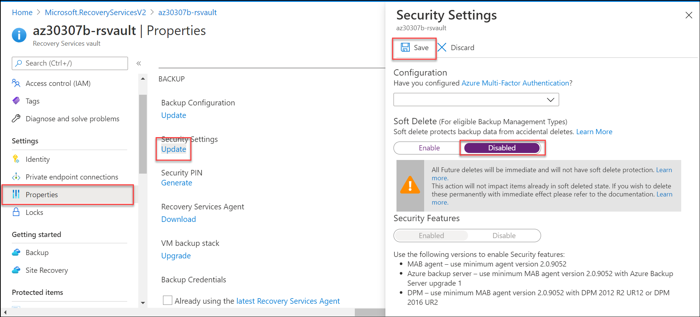

### Exercise 2: Implement Hyper-V protection by using Azure Site Recovery vault
  
The main tasks for this exercise are as follows:

1. Implement the target Azure environment

1. Implement protection of a Hyper-V virtual machine

1. Perform a failover of the Hyper-V virtual machine

1. Remove Azure resources deployed in the lab


#### Task 1: Implement the target Azure environment

1. In the Azure portal, search for and select **Virtual networks** and, on the **Virtual networks** blade, select **+ Add**.

    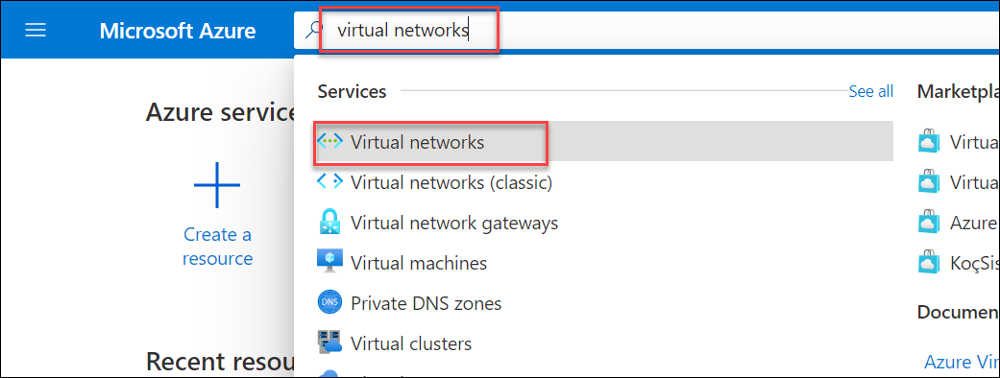

1. On the **Basics** tab of the **Create virtual network** blade, specify the following settings (leave others with their default values) and select **Next: IP Addresses**:

    | Setting | Value |
    | --- | --- |
    | Subscription | the name of the Azure subscription you are using in this lab |
    | Resource group | the name of a new resource group **az30307c-labRG** |
    | Name | **az30307c-dr-vnet** |
    | Region | the name of the Azure region into which you deployed the virtual machine earlier in this lab |

    

1. On the **IP addresses** tab of the **Create virtual network** blade, in the **IPv4 address space** text box, type **10.7.0.0/16** and select **+ Add subnet**.

1. On the **Add subnet** blade, specify the following settings (leave others with their default values) and select **Add**:

    | Setting | Value |
    | --- | --- |
    | Subnet name | **subnet0** |
    | Subnet address range | **10.7.0.0/24** |

    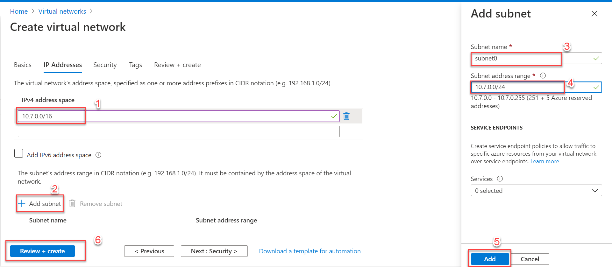
    
1. Back on the **IP addresses** tab of the **Create virtual network** blade, select **Review + create**.

1. On the **Review + create** tab of the **Create virtual network** blade, select **Create**.

1. In the Azure portal, search for and select **Virtual networks** and, on the **Virtual networks** blade, select **+ Add**.

1. On the **Basics** tab of the **Create virtual network** blade, specify the following settings (leave others with their default values) and select **Next: IP Addresses**:

    | Setting | Value |
    | --- | --- |
    | Subscription | the name of the Azure subscription you are using in this lab |
    | Resource group | **az30307c-labRG** |
    | Name | **az30307c-test-vnet** |
    | Region | the name of the Azure region into which you deployed the virtual machine earlier in this lab |

1. On the **IP addresses** tab of the **Create virtual network** blade, in the **IPv4 address space** text box, type **10.7.0.0/16** and select **+ Add subnet**.

1. On the **Add subnet** blade, specify the following settings (leave others with their default values) and select **Add**:

    | Setting | Value |
    | --- | --- |
    | Subnet name | **subnet0** |
    | Subnet address range | **10.7.0.0/24** |

1. Back on the **IP addresses** tab of the **Create virtual network** blade, select **Review + create**.

1. On the **Review + create** tab of the **Create virtual network** blade, select **Create**.

1. In the Azure portal, search for and select **Storage accounts** and, on the **Storage accounts** blade, select **+ Add**.

1. On the **Basics** tab of the **Create storage account** blade, specify the following settings (leave others with their default values):

    | Setting | Value | 
    | --- | --- |
    | Subscription | the name of the Azure subscription you are using in this lab |
    | Resource group | **az30307c-labRG** |
    | Storage account name | any globally unique name between 3 and 24 in length consisting of letters and digits |
    | Location | the name of the Azure region in which you created the virtual network earlier in this task |
    | Performance | **Standard** |
    | Account kind | **StorageV2 (general purpose v2)** |
    | Replication | **Locally redundant storage (LRS)** |

1. On the **Basics** tab of the **Create storage account** blade, select **Review + create**.

    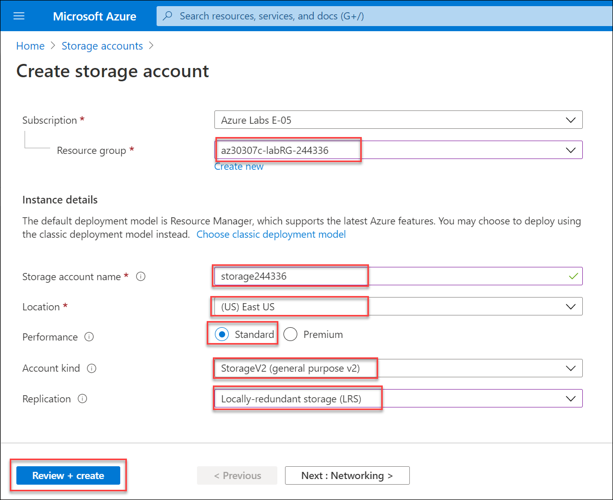

1. On the **Review + create** tab of the **Create storage account** blade, select **Create**.


#### Task 2: Implement protection of a Hyper-V virtual machine

1. Within the Remote Desktop session to **az30307a-hv-vm**, in the Azure portal, on the **az30307b-rsvault** blade, in the **Getting started** section, select **Site Recovery**

1. On the **az30307b-rsvault | Site Recovery** blade, select **Prepare infrastructure** Under Hyper-V's to Azure. 

    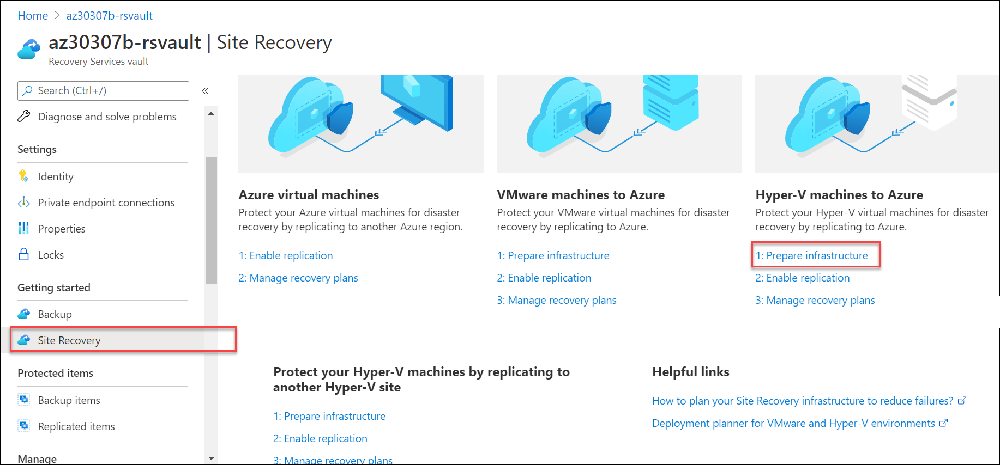

1. On the **Deployment planning** blade, in the drop-down list labeled **Have you completed deployment planning?**, select **Yes, I have done it** and select **OK**:

    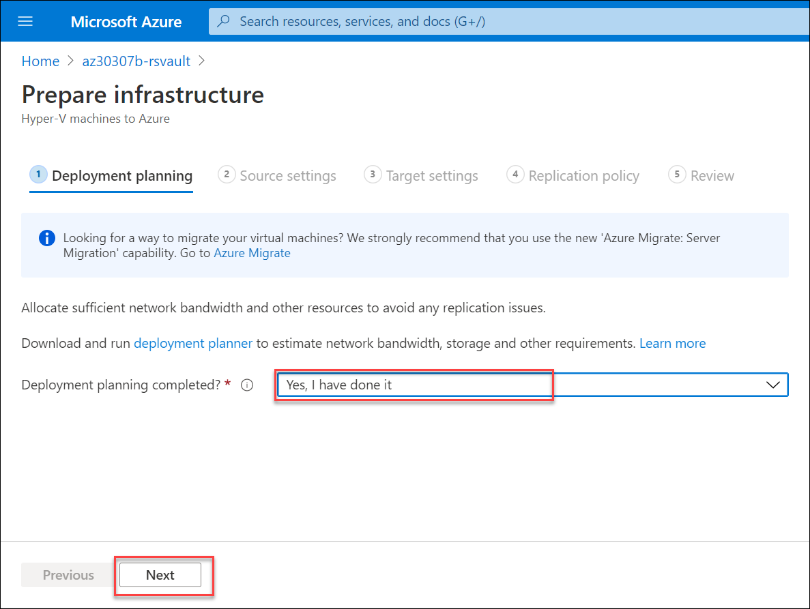

1. On the **source settings** blade, Select **No** for **Are you using system center VMM to manage Hyper-V hosts?** and then select **Add Hyper-V Site**. 

1. On the **Create Hyper-V Site** blade, in the **Name** text box, type **az30307b Hyper-V site** and select **OK**:

    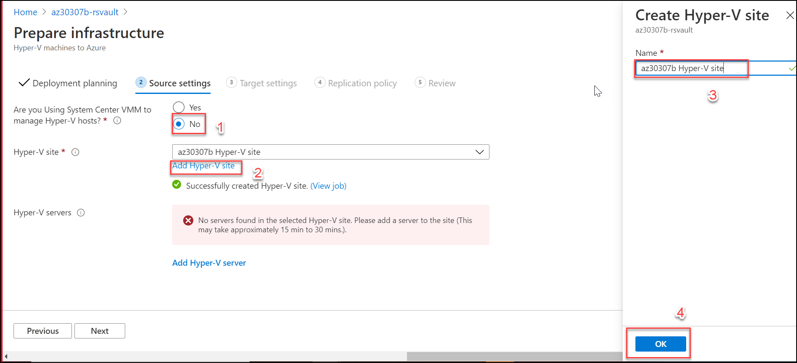

1. Back on the **Prepare source** blade, select **+ Hyper-V Server**. 

    >**Note**: You might have to refresh the browser page. 

1. On the **Add Server** blade, select the **Download** link in step 3 of the procedure for registering on-premises Hyper-V hosts in order to download the Microsoft Azure Site Recovery Provider.

    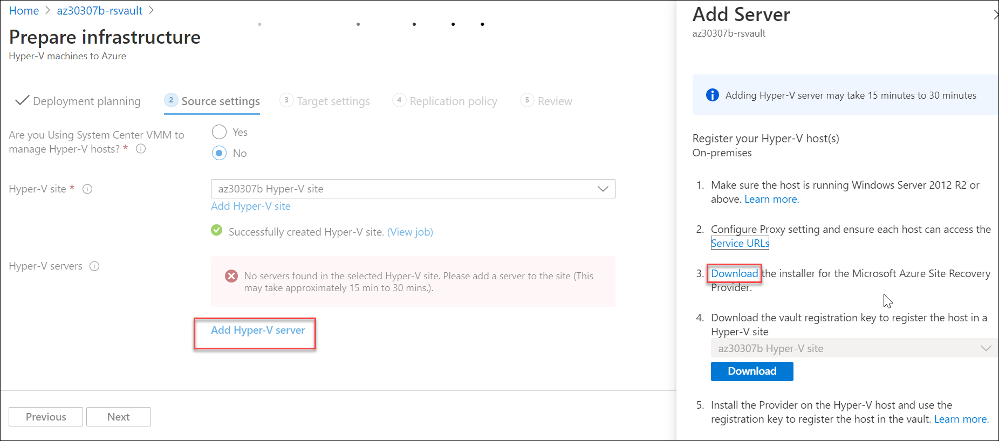

1. When prompted, launch **AzureSiteRecoveryProvider.exe**. This will start the **Azure Site Recovery Provider Setup (Hyper-V server)** wizard.

1. On the **Microsoft Update** page, select **Off** and select **Next**.

1. On the **Provider installation** page, select **Install**.

1. Switch to the Azure portal and, on the **Add Server** blade, select the **Download** button in step 4 of the procedure for registering on-premises Hyper-V hosts in order to download the vault registration key. When prompted, save the registration key in the **Downloads** folder.

    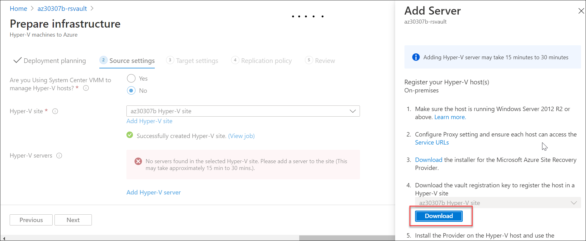

1. Switch to the **Provider installation** page and select **Register**. This will start the **Microsoft Azure Site Recovery Registration Wizard**.

1. On the **Vault Settings** page of the **Microsoft Azure Site Recovery Registration Wizard**, select **Browse**, navigate to the **Downloads** folder, select the vault credentials file, and select **Open**.

    

1. Back on the **Vault Settings** page of the **Microsoft Azure Site Recovery Registration Wizard**, select **Next**.

    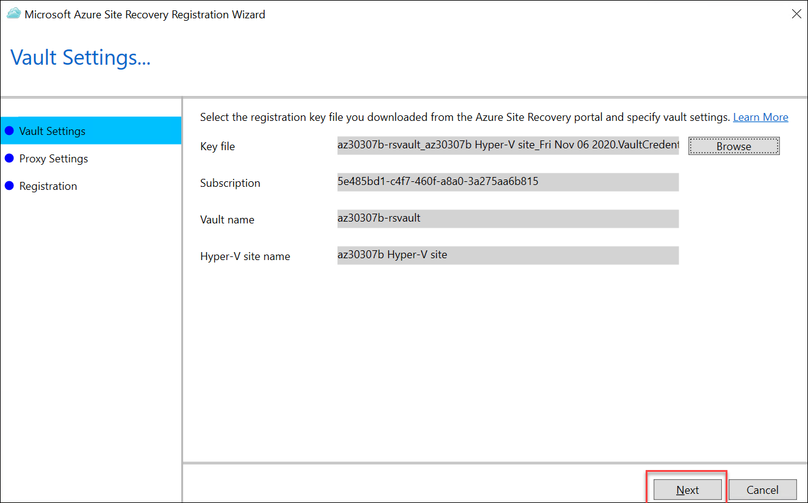

1. On the **Proxy Settings** page of the **Microsoft Azure Site Recovery Registration Wizard**, accept the default settings and select **Next**.

1. On the **Registration** page of the **Microsoft Azure Site Recovery Registration Wizard**, select **Finish**.

    

1. Refresh the page displaying the Azure portal and repeat the sequence of steps until you reach the **Prepare source** blade. Ensure that both Hyper-V site and Hyper-V server have been added and select **OK**.

    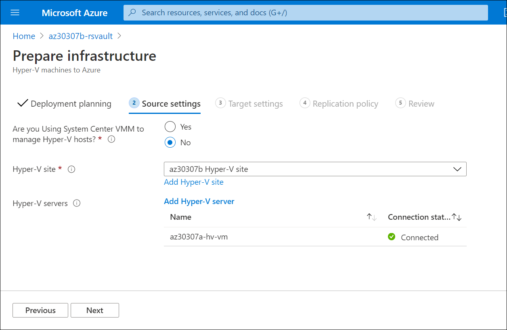

1. On the **Target** blade, select **+ Storage account** and select the storage account you created in the first task of this exercise.

1. On the **Target** blade, select **+ Network** and select the virtual network you created in the first task of this exercise.

1. On the **Replication policy** blade, select **+ Create and Associate**. 

1. On the **Create and Associate** blade, specify the following settings (leave others with their default values) and select **OK**:

    | Setting | Value |
    | --- | --- |
    | Name | **az30307c replication policy** |
    | Copy frequency | **30 seconds** |

1. Back on the **Prepare infrastructure** blade, select **OK**.

1. Back on the **az30307b-rsvault | Site Recovery** blade, in the **For on-premises machines and Azure VMs** section, select **Step 1: Replicate Application**. 

1. On the **Source** blade, accept the default settings and select **OK**.

    >**Note**: If the **OK** un-select and re-select items in the drop-down lists.

1. On the **Target** blade, specify the following settings (leave others with their default values) and select **OK**:

    | Setting | Value |
    | --- | --- |
    | Subscription | the name of the Azure subscription you are using in this lab |
    | Post-failover resource group | **az30307c-labRG** |
    | Post-failover deployment model | **Resource Manager** |
    | Storage account | the name of the storage account you created in the first task of this exercise |
    | Azure network | Configure now for selected machines |
    | Post-failover Azure network | **az30307c-dr-vnet** |
    | Subnet | **subnet0 (10.7.0.0/24)** |

1. On the **Select virtual machines** blade, select **az30307a-vm1** and select **OK**:

1. On the **Configure properties** blade, in the **Defaults** row and **OS type** column, select **Windows** from the drop-down list and select **OK**:

1. On the **Configure replication settings** blade, accept the default settings and select **OK**:

1. Back on the **Enable replication** blade, select **Enable replication**.


#### Task 3: Review Azure VM replication settings

1. In the Azure portal, navigate back to the **az30307b-rsvault** blade and select **Replicated items**. 

1. On the **az30307b-rsvault | Replicated items** blade, ensure that there is an entry representing the **az30307a-vm1** virtual machine and verify that its **Replication Health** is listed as **Healthy** and that its **Status** is listed as **Enabling protection**.

    > **Note**: You might need to wait a few minutes until the **az30307a-vm1** entry appears on the **az30307b-rsvault - Replicated items** blade.

1. On the **az30307b-rsvault - Replicated items** blade, select the **az30307a-vm1** entry.

1. On the **az30307a-vm1** replicated items blade, review the **Health and status**, **Failover readiness**, **Latest recovery points**, and **Infrastructure view** sections. Note the **Planned Failover**, **Failover** and **Test Failover** toolbar icons.

1. Wait until the status changes to **Protected**. This might take additional 15 minutes.

1. On the **az30307a-vm1** replicated items blade, select **Latest recovery points** and review **Latest crash-consistent** and **Latest app-consistent** recovery points.


#### Task 3: Perform a failover of the Hyper-V virtual machine

1. Within the Remote Desktop session to **az30307a-vm0**, in the browser window displaying the Azure portal, on the **az30307a-vm1** replicated items blade, select **Test failover**. 

1. On the **Test failover** blade, specify the following settings (leave others with their default values) and select **OK**:

    | Setting | Value |
    | --- | --- |
    | Choose a recovery point | the default option | 
    | Azure virtual network | **az30307c-test-vnet** | 


1. In the Azure portal, navigate back to the **az30307b-rsvault** blade and select **Site Recovery jobs**. Wait until the status of the **Test failover** job is listed as **Successful**.

1. In the Azure portal, search for and select **Virtual machines** and, on the **Virtual machines** blade, note the entry representing the newly provisioned virtual machine **az30307a-vm1-test**.

1. In the Azure portal, navigate back to the on the **az30307a-vm1** replicated items blade and select **Cleanup test failover*.

1. On the **Test failover cleanup** blade, select the checkbox **Testing is complete. Delete test failover virtual machine(s)** and select **OK**.

1. Once the test failover cleanup job completes, refresh the browser page displaying the **az30307a-vm1** replicated items blade and note that you have the option to perform planned and unplanned failover.

1. On the **az30307a-vm1** replicated items blade, select **Planned failover**. 

1. On the **Planned failover** blade, note that the failover direction settings are already set and not modifiable. 

1. Close the **Planned failover** blade and, on the **az30307a-vm1** replicated items blade, select **Failover**. 

1. On the **Failover** blade, note the available options geared towards minimizing potential data loss. 

1. Close the **Failover** blade.


#### Task 4: Remove Azure resources deployed in the lab

1. Within the Remote Desktop session to **az30307a-vm0**, in the browser window displaying the Azure portal, start a PowerShell session within the Cloud Shell pane.

1. From the Cloud Shell pane, run the following to list the resource group you created in this exercise:

   ```powershell
   Get-AzResourceGroup -Name 'az30307*'
   ```

    > **Note**: Verify that the output contains only the resource group you created in this lab. This group will be deleted in this task.

1. From the Cloud Shell pane, run the following to delete the resource group you created in this lab

   ```powershell
   Get-AzResourceGroup -Name 'az30307*' | Remove-AzResourceGroup -Force -AsJob
   ```

1. Close the Cloud Shell pane.
